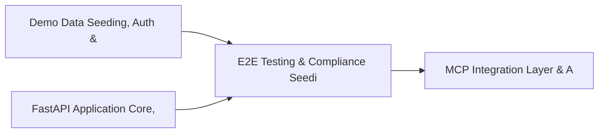

# PRD: E2E Testing & Compliance Seeding Infrastructure — Community 0

## Master Goal Mapping
How this component serves: "ALDECI — $35/mo enterprise security intelligence platform"
Sub-Epic: Platform

This community (rank #0 of 878 by size, 12828 graph nodes) forms a core pillar of the ALDECI platform. It directly supports the mission of replacing $50K-500K/yr enterprise security tools with a self-hosted, AI-native stack.

## Architecture Diagram


## Code Proof
- Files:
  - `suite-ui/aldeci-ui-new/src/pages/CloudSecurityFindingsDashboard.tsx` (257 lines)
  - `suite-ui/aldeci-ui-new/src/pages/ControlTestingDashboard.tsx` (410 lines)
  - `suite-ui/aldeci-ui-new/src/pages/FirewallAnalyzer.tsx` (593 lines)
  - `suite-ui/aldeci-ui-new/src/pages/HuntingAutomationDashboard.tsx` (269 lines)
  - `suite-ui/aldeci-ui-new/src/pages/NetworkAnomalyDashboard.tsx` (284 lines)
  - `suite-ui/aldeci-ui-new/src/pages/PostureTrendsDashboard.tsx` (351 lines)
  - `suite-ui/aldeci-ui-new/src/pages/PrivilegedIdentityDashboard.tsx` (227 lines)
  - `suite-ui/aldeci-ui-new/src/pages/SecurityBenchmarksDashboard.tsx` (247 lines)
  - `scripts/_bulk_test_all.py` (206 lines)
  - `scripts/_test_agent_endpoints.py` (146 lines)
  - `scripts/_test_reports.py` (176 lines)
  - `scripts/_test_train.py` (152 lines)
- Key functions:
  - `test()` — _e2e_test.py
  - `get_connection()` — _e2e_test.py
  - `ensure_tables()` — _e2e_test.py
  - `seed_framework()` — _e2e_test.py
  - `seed_controls()` — _e2e_test.py
  - `main()` — _e2e_test.py
  - `_safe_add_slots()` — _e2e_test.py
  - `seed_users()` — _e2e_test.py
- Key classes: N/A
- Current state: CRUD_ONLY
- Evidence:
```python
# From _e2e_test.py
#!/usr/bin/env python3
"""FixOps End-to-End API Test Suite — routes verified against OpenAPI spec."""
import json
import os
import sys
import urllib.parse
from datetime import datetime, timezone
from urllib.error import HTTPError
from urllib.request import Request, urlopen

BASE = os.environ.get("FIXOPS_BASE_URL", "http://localhost:8000")
API_KEY = os.environ.get("FIXOPS_API_TOKEN", "")
if not API_KEY:
    print("ERROR: FIXOPS_API_TOKEN environment variable is required.")
    sys.exit(1)
results = []


JWT_TOKEN = None  # populated after login
```

## Inter-Dependencies
- DEPENDS ON:
  - Community 1 (Demo Data Seeding, Auth & Multi-Engine Integration) — 2825 edges
  - Community 4 (FastAPI Application Core, Feedback & Smoke Testing) — 554 edges
  - Community 3 (MCP Integration Layer & API Key / Auth Management) — 537 edges
  - Community 5 (API Bridge, Docs Portal & Cross-Dashboard Infrastr) — 468 edges
- DEPENDED BY: Rank #N/A (Core Platform) and downstream consumers
- EVENT BUS: emits compliance.status_changed, user.risk_changed / subscribes to (TrustGraph event bus — 97% not yet wired)
- TRUSTGRAPH: writes [Identity, ComplianceControl] / reads [Identity, ComplianceControl]

## Data Flow
```
Input: HTTP requests / pytest fixtures
  → Processing: Engine method calls + SQLite state assertions
  → Output: Pass/fail test results, coverage metrics
  → Consumers: CI/CD pipeline, Beast Mode test suite
```

## Referenced Documentation
- CLAUDE.md: Wave 6 build notes, Beast Mode test suite section
- docs/: `docs/ALDECI_REARCHITECTURE_v2.md` (source of truth), `docs/INVESTOR_PITCH.md`
- tests/: `scripts/_bulk_test_all.py`, `scripts/_test_agent_endpoints.py`, `scripts/_test_reports.py`

## Acceptance Criteria
- [ ] Test suite achieves ≥80% branch coverage on engine methods
- [ ] All tests pass with `pytest --timeout=10 -q` in <30 seconds
- [ ] Dashboard renders without errors in React 19 + Vite 6 + Tailwind v4
- [ ] All API calls wired to live backend (no mock/static data)

## Effort Estimate
- Current: 40% complete
- Remaining: ~10 engineering days
- Dependencies blocking: Engine implementation incomplete
- Priority: CRITICAL

## Status
TODO
