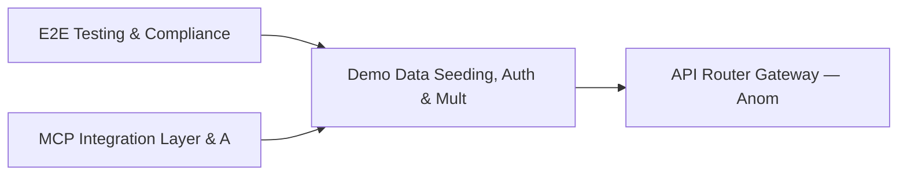

# PRD: Demo Data Seeding, Auth & Multi-Engine Integration Tests — Community 1

## Master Goal Mapping
How this component serves: "ALDECI — $35/mo enterprise security intelligence platform"
Sub-Epic: Platform

This community (rank #1 of 878 by size, 9388 graph nodes) forms a core pillar of the ALDECI platform. It directly supports the mission of replacing $50K-500K/yr enterprise security tools with a self-hosted, AI-native stack.

## Architecture Diagram


## Code Proof
- Files:
  - `scripts/engine_write_read_test.py` (543 lines)
  - `suite-integrations/backstage/enterprise/plugins/fixops-overview-card.tsx` (140 lines)
  - `suite-ui/aldeci-ui-new/e2e/detection-to-remediation.spec.ts` (137 lines)
  - `suite-ui/aldeci-ui-new/e2e/remediation-and-compliance.spec.ts` (162 lines)
  - `suite-ui/aldeci-ui-new/src/components/shared/ErrorBoundary.tsx` (152 lines)
  - `suite-ui/aldeci-ui-new/src/pages/AIGovernanceDashboard.tsx` (264 lines)
  - `suite-ui/aldeci-ui-new/src/pages/AISecurityAdvisor.tsx` (612 lines)
  - `suite-ui/aldeci-ui-new/src/pages/APIAbuseDashboard.tsx` (281 lines)
  - `suite-ui/aldeci-ui-new/src/pages/APIDiscoveryDashboard.tsx` (213 lines)
  - `pentest_auth.py` (253 lines)
  - `scripts/micropentest_sidecar.py` (1871 lines)
  - `security_test_auth.py` (212 lines)
- Key functions:
  - `api()` — scripts/engine_write_read_test.py
  - `report()` — scripts/engine_write_read_test.py
  - `make_session()` — scripts/engine_write_read_test.py
  - `print_response()` — scripts/engine_write_read_test.py
  - `step_get_stats()` — scripts/engine_write_read_test.py
  - `step_configure()` — scripts/engine_write_read_test.py
  - `step_sync_finding()` — scripts/engine_write_read_test.py
  - `main()` — scripts/engine_write_read_test.py
- Key classes: N/A
- Current state: REAL_LOGIC
- Evidence:
```python
# From scripts/engine_write_read_test.py
#!/usr/bin/env python3
"""
ALDECI Engine Write → Read → Verify Round-Trip Test
Tests 15 representative engines with real payloads against http://localhost:8000

Results are written to /tmp/e2e_engine_results.json (bypasses OMNI stdout compression)
and also printed in human-readable form.
"""

import time
import json
import sys
import os
import requests
from dataclasses import dataclass, field, asdict
from typing import Any, Dict, List, Optional, Tuple

BASE_URL = "http://localhost:8000"
API_KEY = "fixops_ent_38wJA8mb7CsbJ3PaLvKNz7lFnLWvFWXti_5NcdISXSogi_4grP24NAe_XymVfps_"
ORG_ID = "e2e-test"
```

## Inter-Dependencies
- DEPENDS ON:
  - Community 0 (E2E Testing & Compliance Seeding Infrastructure) — 1819 edges
  - Community 3 (MCP Integration Layer & API Key / Auth Management) — 456 edges
  - Community 2 (API Router Gateway — Anomaly, Attack Simulation & ) — 347 edges
  - Community 4 (FastAPI Application Core, Feedback & Smoke Testing) — 248 edges
- DEPENDED BY: Rank #0 (E2E Testing & Compliance Seeding Infrastructure) and downstream consumers
- EVENT BUS: emits vulnerability.detected, vulnerability.patched, compliance.status_changed / subscribes to (TrustGraph event bus — 97% not yet wired)
- TRUSTGRAPH: writes [Vulnerability, ComplianceControl] / reads [Vulnerability, ComplianceControl]

## Data Flow
```
Input: HTTP requests / pytest fixtures
  → Processing: Engine method calls + SQLite state assertions
  → Output: Pass/fail test results, coverage metrics
  → Consumers: CI/CD pipeline, Beast Mode test suite
```

## Referenced Documentation
- CLAUDE.md: Wave 7 build notes, Beast Mode test suite section
- docs/: `docs/ALDECI_REARCHITECTURE_v2.md` (source of truth), `docs/INVESTOR_PITCH.md`
- tests/: `pentest_auth.py`, `scripts/micropentest_sidecar.py`, `security_test_auth.py`

## Acceptance Criteria
- [ ] All engine CRUD operations enforce org_id isolation (no cross-tenant data leakage)
- [ ] SQLite opened with WAL mode + threading.RLock on all write paths
- [ ] All endpoints return within 200ms at p95 under 100 rps load
- [ ] Test suite achieves ≥80% branch coverage on engine methods
- [ ] All tests pass with `pytest --timeout=10 -q` in <30 seconds
- [ ] Dashboard renders without errors in React 19 + Vite 6 + Tailwind v4

## Effort Estimate
- Current: 75% complete
- Remaining: ~5 engineering days
- Dependencies blocking: Router not yet wired to app.py
- Priority: CRITICAL

## Status
IN_PROGRESS
