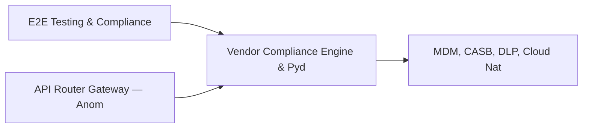

# PRD: Vendor Compliance Engine & Pydantic BaseModel Framework — Community 10

## Master Goal Mapping
How this component serves: "ALDECI — $35/mo enterprise security intelligence platform"
Sub-Epic: GRC

This community (rank #10 of 878 by size, 1732 graph nodes) forms a core pillar of the ALDECI platform. It directly supports the mission of replacing $50K-500K/yr enterprise security tools with a self-hosted, AI-native stack.

## Architecture Diagram


## Code Proof
- Files:
  - `suite-api/apps/api/cloud_security_engine_router.py` (242 lines)
  - `suite-api/apps/api/access_anomaly_router.py` (188 lines)
  - `suite-api/apps/api/api_abuse_detection_router.py` (196 lines)
  - `suite-api/apps/api/cloud_incident_response_router.py` (225 lines)
  - `suite-api/apps/api/cloud_native_security_router.py` (176 lines)
  - `suite-api/apps/api/cloud_security_engine_router.py` (242 lines)
  - `suite-api/apps/api/compliance_scanner_router.py` (170 lines)
  - `suite-api/apps/api/data_exfiltration_router.py` (197 lines)
  - `suite-api/apps/api/digital_forensics_router.py` (156 lines)
  - `suite-api/apps/api/pentest_mgmt_router.py` (214 lines)
- Key functions:
  - `engine()` — suite-api/apps/api/cloud_security_engine_router.py
  - `org()` — suite-api/apps/api/cloud_security_engine_router.py
  - `org2()` — suite-api/apps/api/cloud_security_engine_router.py
  - `_vendor()` — suite-api/apps/api/cloud_security_engine_router.py
  - `_requirement()` — suite-api/apps/api/cloud_security_engine_router.py
  - `test_register_vendor_returns_record()` — suite-api/apps/api/cloud_security_engine_router.py
  - `test_register_vendor_missing_name_raises()` — suite-api/apps/api/cloud_security_engine_router.py
  - `test_register_vendor_invalid_category_raises()` — suite-api/apps/api/cloud_security_engine_router.py
- Key classes: `BaseModel`, `TestGradeCalculation`, `TestTierCalculation`, `TestVendorCRUD`, `TestManualAssessment`
- Current state: REAL_LOGIC
- Evidence:
```python
# From suite-api/apps/api/cloud_security_engine_router.py
"""Cloud Security Engine Router — ALDECI.

Endpoints for CSPM + cloud misconfiguration tracking.

Prefix: /api/v1/cloud-security-engine
Auth:   api_key_auth dependency

Routes:
  POST   /accounts                         add_account
  GET    /accounts                         list_accounts
  POST   /findings                         add_finding
  GET    /findings                         list_findings
  PATCH  /findings/{finding_id}/resolve    resolve_finding
  POST   /resources                        add_resource
  GET    /resources                        list_resources
  POST   /benchmarks      
```

## Inter-Dependencies
- DEPENDS ON:
  - Community 0 (E2E Testing & Compliance Seeding Infrastructure) — 270 edges
  - Community 2 (API Router Gateway — Anomaly, Attack Simulation & ) — 106 edges
  - Community 7 (MDM, CASB, DLP, Cloud Native & Browser Security Ro) — 106 edges
  - Community 1 (Demo Data Seeding, Auth & Multi-Engine Integration) — 105 edges
- DEPENDED BY: Rank #9 (Integrations Hub — Connectors, Bulk Operations & MCP Gateway) and downstream consumers
- EVENT BUS: emits compliance.status_changed / subscribes to (TrustGraph event bus — 97% not yet wired)
- TRUSTGRAPH: writes [Incident, ComplianceControl, CloudResource] / reads [ComplianceControl, CloudResource]

## Data Flow
```
Input: HTTP requests / pytest fixtures
  → Processing: Engine method calls + SQLite state assertions
  → Output: Pass/fail test results, coverage metrics
  → Consumers: CI/CD pipeline, Beast Mode test suite
```

## Referenced Documentation
- CLAUDE.md: Wave 16 build notes, Beast Mode test suite section
- docs/: `docs/ALDECI_REARCHITECTURE_v2.md` (source of truth), `docs/INVESTOR_PITCH.md`
- tests/: `suite-api/apps/api/pentest_mgmt_router.py`

## Acceptance Criteria
- [ ] All engine CRUD operations enforce org_id isolation (no cross-tenant data leakage)
- [ ] SQLite opened with WAL mode + threading.RLock on all write paths
- [ ] All endpoints return within 200ms at p95 under 100 rps load
- [ ] All router endpoints protected by `Depends(api_key_auth)` or equivalent
- [ ] Pydantic v2 models validate all request/response schemas
- [ ] Test suite achieves ≥80% branch coverage on engine methods

## Effort Estimate
- Current: 80% complete
- Remaining: ~2 engineering days
- Dependencies blocking: Frontend dashboard not yet created
- Priority: HIGH

## Status
IN_PROGRESS
