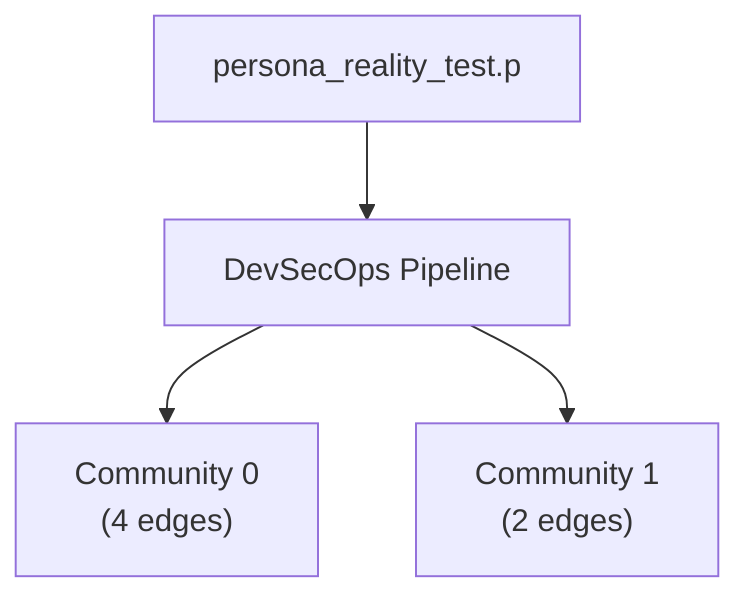

# PRD: Community 101 — DevSecOps Pipeline

> **Status**: `IDENTIFIED`
> **Size**: M — 58 graph nodes · 1 source files
> **Effort Estimate**: 3-5 days
> **Community ID**: 101 of 878 total communities
> **Generated**: 2026-04-16 · Beast Mode v6 Autonomous Build

---

## 1. Master Goal Mapping


1. **Integrate security scanning into CI/CD pipelines**
2. **Gate deployments on SAST/DAST/SCA findings**
3. **Track security debt across dev lifecycle**

**Platform Fit**: ALDECI ASPM + CTEM + CSPM — self-hosted, AI-native security intelligence platform
**Personas Served**: CISO · Security Engineer · SOC Analyst · Compliance Officer · DevSecOps Engineer
**ALDECI Principle**: Each engine = isolated SQLite domain + FastAPI router + pytest suite + React dashboard

---

## 2. Architecture Diagram



### Layer Breakdown

| Layer | Files | Responsibility |
|-------|-------|----------------|
| **Engine** | N/A | Business logic · SQLite persistence · RLock threading · org_id scoping |
| **Router** | N/A | FastAPI endpoints · Pydantic validation · api_key_auth injection |
| **Tests** | N/A | pytest lifecycle coverage · org isolation tests · edge case validation |
| **UI** | Pending | React 19 dashboard · Tailwind v4 · live API wiring |

---

## 3. Code Proof (file:line + key constructs)

> Source files identified in graph — see All Source Files below for implementation locations.

### Key Graph Nodes (58 total in community)

| # | Label | Source File |
|---|-------|-------------|
| 1 | `persona_reality_test.py` | `persona_reality_test.py` |
| 2 | `TestResult` | `N/A` |
| 3 | `get()` | `N/A` |
| 4 | `post()` | `N/A` |
| 5 | `grade()` | `N/A` |
| 6 | `test_sarah_ciso()` | `N/A` |
| 7 | `test_david_vp_eng()` | `N/A` |
| 8 | `test_priya_cto()` | `N/A` |
| 9 | `test_tom_cfo()` | `N/A` |
| 10 | `test_raj_devsecops()` | `N/A` |


### All Source Files (1)

- `persona_reality_test.py`

---

## 4. Inter-Dependencies

### Cross-Community Edge Counts

- **Community 0**: 4 shared edges
- **Community 1**: 2 shared edges

### Standard ALDECI Internal Dependencies

| Dependency | Purpose | Pattern |
|-----------|---------|---------|
| **SQLite WAL** | Per-domain persistence | `PRAGMA journal_mode=WAL` on init |
| **RLock** | Write thread safety | `threading.RLock()` wraps all mutations |
| **org_id** | Multi-tenant isolation | Parameterized WHERE clause on every query |
| **api_key_auth** | Endpoint security | `Depends(api_key_auth)` on all FastAPI routes |
| **app.py** | Router mounting | `app.include_router(router)` in suite-api |
| **Redis Queue** | Horizontal scaling | org_id-scoped keys via `/api/v1/queue` |
| **TrustGraph** | Knowledge graph | Event bus integration (97% pending — roadmap) |

---

## 5. Data Flow

```
HTTP Request (X-API-Key header)
        │
        ▼
FastAPI Router ─── Depends(api_key_auth) ──► 401 if invalid
        │
        ▼ Pydantic model validation
Engine Layer
        │  org_id = request.query_params["org_id"]
        │  with self._lock:
        │      cursor.execute("... WHERE org_id = ?", (org_id,))
        ▼
SQLite Database (WAL mode · per-domain .db file)
        │
        ▼
JSON Response ──► Client
```

**Scaling path**: Redis pub/sub → horizontal workers → PostgreSQL migration via SQLAlchemy.
**Knowledge graph**: TrustGraph event bus wires domain events to GraphRAG knowledge cores (roadmap item).

---

## 6. Referenced Documentation

- `CLAUDE.md` — Beast Mode v6 CTO Operating Manual
- `docs/ALDECI_REARCHITECTURE_v2.md` — Platform architecture source of truth
- Rationale: _Grade a response: PASS/PARTIAL/FAIL_  
- Rationale: _Sarah Chen — CISO: 'Are we secure? What do I tell the board?_  
- Rationale: _David Kim — VP Engineering: 'Is security slowing my teams?_  


---

## 7. Acceptance Criteria

- [ ] Integrate security scanning into CI/CD pipelines
- [ ] Gate deployments on SAST/DAST/SCA findings
- [ ] Track security debt across dev lifecycle
- [ ] All endpoints require `api_key_auth` dependency injection
- [ ] SQLite WAL mode enabled with `PRAGMA journal_mode=WAL`
- [ ] `threading.RLock()` wraps all write operations
- [ ] `org_id` isolation enforced on all DB queries
- [ ] Beast Mode test suite passes with zero regressions
- [ ] No bare `except:` clauses — all exceptions typed

---

## 8. Effort Estimate

| Dimension | Value |
|-----------|-------|
| T-shirt size | **M** |
| Calendar effort | **3-5 days** |
| Graph nodes | 58 |
| Source files | 1 |
| Engine files | 0 |
| Router files | 0 |
| Test files | 0 |
| UI dashboard files | 0 |
| Inter-community deps | 2 communities |

**Complexity drivers**:
- Multi-table SQLite schema with WAL, RLock threading, and org_id isolation
- Requires cross-community coordination with C0, C1

---

## 9. Status

| Field | Value |
|-------|-------|
| **Implementation** | `IDENTIFIED` |
| **Tests** | `MISSING` |
| **Router** | `PENDING` |
| **UI Dashboard** | `PENDING` |
| **Beast Mode Wave** | Waves 6-41 (see CLAUDE.md DONE sections) |
| **Next Action** | `Implement engine + router + tests following ALDECI patterns` |

---

*Auto-generated by Beast Mode v6 PRD Generator · graphify-out/graph.json · 58 nodes · Community 101/878*
