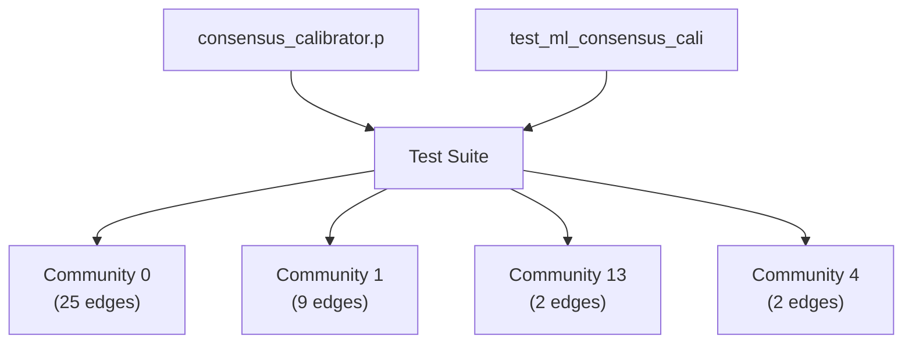

# PRD: Community 103 — Test Suite

> **Status**: `PARTIAL (tests only)`
> **Size**: M — 57 graph nodes · 2 source files
> **Effort Estimate**: 3-5 days
> **Community ID**: 103 of 878 total communities
> **Generated**: 2026-04-16 · Beast Mode v6 Autonomous Build

---

## 1. Master Goal Mapping


1. **Maintain pytest test coverage for all engines**
2. **Enforce 10s timeout on all tests**
3. **Track test counts per Beast Mode wave**

**Platform Fit**: ALDECI ASPM + CTEM + CSPM — self-hosted, AI-native security intelligence platform
**Personas Served**: CISO · Security Engineer · SOC Analyst · Compliance Officer · DevSecOps Engineer
**ALDECI Principle**: Each engine = isolated SQLite domain + FastAPI router + pytest suite + React dashboard

---

## 2. Architecture Diagram



### Layer Breakdown

| Layer | Files | Responsibility |
|-------|-------|----------------|
| **Engine** | N/A | Business logic · SQLite persistence · RLock threading · org_id scoping |
| **Router** | N/A | FastAPI endpoints · Pydantic validation · api_key_auth injection |
| **Tests** | test_ml_consensus_calibrator.py | pytest lifecycle coverage · org isolation tests · edge case validation |
| **UI** | Pending | React 19 dashboard · Tailwind v4 · live API wiring |

---

## 3. Code Proof (file:line + key constructs)


**Tests** — `tests/test_ml_consensus_calibrator.py`:
```python
# 1 test file(s) — pytest, @pytest.mark.timeout(10)
@pytest.fixture
def engine(tmp_path):
    return Engine(str(tmp_path / "test.db"), "test_org")
def test_create_and_retrieve(engine):
    item = engine.create({"name": "test"}, "test_org")
    assert item["id"]
    assert engine.get(item["id"], "test_org")
```


### Key Graph Nodes (57 total in community)

| # | Label | Source File |
|---|-------|-------------|
| 1 | `test_ml_consensus_calibrator.py` | `suite-core/core/ml/consensus_calibrator.py` |
| 2 | `calibrator()` | `tests/test_ml_consensus_calibrator.py` |
| 3 | `perfect_predictions()` | `N/A` |
| 4 | `ground_truth()` | `N/A` |
| 5 | `bad_predictions()` | `N/A` |
| 6 | `TestEvaluationRecording` | `N/A` |
| 7 | `.test_record_returns_evaluation()` | `N/A` |
| 8 | `.test_perfect_predictions_high_f1()` | `N/A` |
| 9 | `.test_bad_predictions_low_f1()` | `N/A` |
| 10 | `.test_evaluation_to_dict()` | `N/A` |


### All Source Files (2)

- `suite-core/core/ml/consensus_calibrator.py`
- `tests/test_ml_consensus_calibrator.py`

---

## 4. Inter-Dependencies

### Cross-Community Edge Counts

- **Community 0**: 25 shared edges
- **Community 1**: 9 shared edges
- **Community 13**: 2 shared edges
- **Community 4**: 2 shared edges

### Standard ALDECI Internal Dependencies

| Dependency | Purpose | Pattern |
|-----------|---------|---------|
| **SQLite WAL** | Per-domain persistence | `PRAGMA journal_mode=WAL` on init |
| **RLock** | Write thread safety | `threading.RLock()` wraps all mutations |
| **org_id** | Multi-tenant isolation | Parameterized WHERE clause on every query |
| **api_key_auth** | Endpoint security | `Depends(api_key_auth)` on all FastAPI routes |
| **app.py** | Router mounting | `app.include_router(router)` in suite-api |
| **Redis Queue** | Horizontal scaling | org_id-scoped keys via `/api/v1/queue` |
| **TrustGraph** | Knowledge graph | Event bus integration (97% pending — roadmap) |

---

## 5. Data Flow

```
HTTP Request (X-API-Key header)
        │
        ▼
FastAPI Router ─── Depends(api_key_auth) ──► 401 if invalid
        │
        ▼ Pydantic model validation
Engine Layer
        │  org_id = request.query_params["org_id"]
        │  with self._lock:
        │      cursor.execute("... WHERE org_id = ?", (org_id,))
        ▼
SQLite Database (WAL mode · per-domain .db file)
        │
        ▼
JSON Response ──► Client
```

**Scaling path**: Redis pub/sub → horizontal workers → PostgreSQL migration via SQLAlchemy.
**Knowledge graph**: TrustGraph event bus wires domain events to GraphRAG knowledge cores (roadmap item).

---

## 6. Referenced Documentation

- `CLAUDE.md` — Beast Mode v6 CTO Operating Manual
- `docs/ALDECI_REARCHITECTURE_v2.md` — Platform architecture source of truth
- `tests/` — pytest test suite (10s timeout)
- Rationale: _Tests for ALdeci AI Consensus Calibrator.  [V3] Decision Intelligence — Validate_  
- Rationale: _Predictions that perfectly match ground truth._  
- Rationale: _Predictions that are mostly wrong._  


---

## 7. Acceptance Criteria

- [ ] Maintain pytest test coverage for all engines
- [ ] Enforce 10s timeout on all tests
- [ ] Track test counts per Beast Mode wave
- [ ] All endpoints require `api_key_auth` dependency injection
- [ ] SQLite WAL mode enabled with `PRAGMA journal_mode=WAL`
- [ ] `threading.RLock()` wraps all write operations
- [ ] `org_id` isolation enforced on all DB queries
- [ ] Beast Mode test suite passes with zero regressions
- [ ] No bare `except:` clauses — all exceptions typed

---

## 8. Effort Estimate

| Dimension | Value |
|-----------|-------|
| T-shirt size | **M** |
| Calendar effort | **3-5 days** |
| Graph nodes | 57 |
| Source files | 2 |
| Engine files | 0 |
| Router files | 0 |
| Test files | 1 |
| UI dashboard files | 0 |
| Inter-community deps | 4 communities |

**Complexity drivers**:
- Multi-table SQLite schema with WAL, RLock threading, and org_id isolation
- Requires cross-community coordination with C0, C1, C13

---

## 9. Status

| Field | Value |
|-------|-------|
| **Implementation** | `PARTIAL (tests only)` |
| **Tests** | `PRESENT — 1 file(s)` |
| **Router** | `PENDING` |
| **UI Dashboard** | `PENDING` |
| **Beast Mode Wave** | Waves 6-41 (see CLAUDE.md DONE sections) |
| **Next Action** | `Implement engine + router + tests following ALDECI patterns` |

---

*Auto-generated by Beast Mode v6 PRD Generator · graphify-out/graph.json · 57 nodes · Community 103/878*
