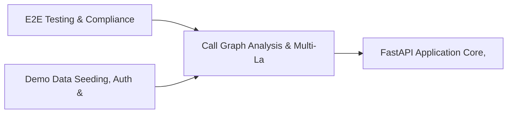

# PRD: Call Graph Analysis & Multi-Language AST Engine — Community 11

## Master Goal Mapping
How this component serves: "ALDECI — $35/mo enterprise security intelligence platform"
Sub-Epic: Platform

This community (rank #11 of 878 by size, 1568 graph nodes) forms a core pillar of the ALDECI platform. It directly supports the mission of replacing $50K-500K/yr enterprise security tools with a self-hosted, AI-native stack.

## Architecture Diagram


## Code Proof
- Files:
  - `suite-api/apps/api/sla_engine_router.py` (212 lines)
  - `suite-core/core/services/enterprise/llm_explanation_engine.py` (599 lines)
  - `suite-api/apps/api/bulk_router.py` (1297 lines)
  - `suite-api/apps/api/cache_router.py` (61 lines)
  - `suite-api/apps/api/sla_engine_router.py` (212 lines)
  - `suite-core/api/ai_code_guardian_router.py` (115 lines)
  - `suite-evidence-risk/api/evidence_router.py` (2046 lines)
  - `suite-ui/aldeci-ui-new/src/pages/attack-surface/AttackSurface.tsx` (1029 lines)
  - `suite-ui/aldeci-ui-new/src/pages/mission-control/DevSecurityDashboard.tsx` (1120 lines)
  - `suite-ui/aldeci/src/components/UserMenu.tsx` (178 lines)
- Key functions:
  - `_build()` — suite-api/apps/api/sla_engine_router.py
  - `is_reachable_from_entry()` — suite-api/apps/api/sla_engine_router.py
  - `_remap_stats()` — suite-api/apps/api/sla_engine_router.py
  - `tmp_repo()` — suite-api/apps/api/sla_engine_router.py
  - `_write()` — suite-api/apps/api/sla_engine_router.py
- Key classes: `TestPythonCallGraph`, `TestJavaScriptCallGraph`, `TestJavaCallGraph`, `TestGoCallGraph`, `TestGenericCallGraph`, `TestQueryHelpers`
- Current state: REAL_LOGIC
- Evidence:
```python
# From suite-api/apps/api/sla_engine_router.py
"""
SLA Engine Router — Security Finding SLA Tracking and Breach Prevention.

Endpoints:
  POST /api/v1/sla-engine/track              — start tracking a finding
  GET  /api/v1/sla-engine/status/{finding_id} — get SLA status
  GET  /api/v1/sla-engine/at-risk            — list at-risk findings
  GET  /api/v1/sla-engine/dashboard          — SLA dashboard stats
  GET  /api/v1/sla-engine/compliance-rate    — compliance rate
  POST /api/v1/sla-engine/resolve/{finding_id} — mark finding resolved
  POST /api/v1/sla-engine/policy             — create SLA policy
  POST /api/v1/sla-engine/alerts         
```

## Inter-Dependencies
- DEPENDS ON:
  - Community 0 (E2E Testing & Compliance Seeding Infrastructure) — 208 edges
  - Community 1 (Demo Data Seeding, Auth & Multi-Engine Integration) — 182 edges
  - Community 4 (FastAPI Application Core, Feedback & Smoke Testing) — 97 edges
  - Community 2 (API Router Gateway — Anomaly, Attack Simulation & ) — 80 edges
- DEPENDED BY: Rank #10 (Vendor Compliance Engine & Pydantic BaseModel Framework) and downstream consumers
- EVENT BUS: emits vulnerability.detected, vulnerability.patched, user.risk_changed / subscribes to (TrustGraph event bus — 97% not yet wired)
- TRUSTGRAPH: writes [Vulnerability, ThreatActor, Identity] / reads [ThreatActor, Identity]

## Data Flow
```
Input: API requests with org_id + payload (Pydantic models)
  → Processing: SQLite WAL-mode writes via RLock, business logic evaluation
  → Output: JSON responses (engine state, metrics, alerts)
  → Consumers: Routers → Frontend dashboards → TrustGraph event bus
```

## Referenced Documentation
- CLAUDE.md: Wave 17 build notes, Beast Mode test suite section
- docs/: `docs/ALDECI_REARCHITECTURE_v2.md` (source of truth), `docs/INVESTOR_PITCH.md`
- tests/: N/A

## Acceptance Criteria
- [ ] All engine CRUD operations enforce org_id isolation (no cross-tenant data leakage)
- [ ] SQLite opened with WAL mode + threading.RLock on all write paths
- [ ] All endpoints return within 200ms at p95 under 100 rps load
- [ ] All router endpoints protected by `Depends(api_key_auth)` or equivalent
- [ ] Pydantic v2 models validate all request/response schemas
- [ ] Dashboard renders without errors in React 19 + Vite 6 + Tailwind v4

## Effort Estimate
- Current: 80% complete
- Remaining: ~2 engineering days
- Dependencies blocking: Test coverage missing
- Priority: HIGH

## Status
IN_PROGRESS
