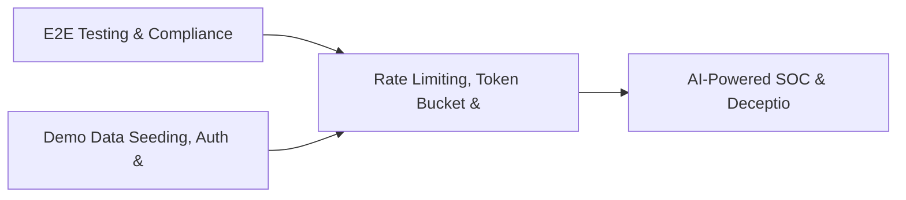

# PRD: Rate Limiting, Token Bucket & Middleware Framework — Community 12

## Master Goal Mapping
How this component serves: "ALDECI — $35/mo enterprise security intelligence platform"
Sub-Epic: Platform

This community (rank #12 of 878 by size, 1563 graph nodes) forms a core pillar of the ALDECI platform. It directly supports the mission of replacing $50K-500K/yr enterprise security tools with a self-hosted, AI-native stack.

## Architecture Diagram


## Code Proof
- Files:
  - `suite-core/core/notification_engine.py` (685 lines)
  - `suite-api/apps/api/ai_powered_soc_router.py` (256 lines)
  - `suite-api/apps/api/api_abuse_router.py` (187 lines)
  - `suite-api/apps/api/api_gateway_router.py` (334 lines)
  - `suite-api/apps/api/api_threat_protection_router.py` (188 lines)
  - `suite-api/apps/api/apikey_router.py` (224 lines)
  - `suite-api/apps/api/code_ownership_router.py` (203 lines)
  - `suite-api/apps/api/exception_policy_router.py` (192 lines)
  - `suite-api/apps/api/firewall_management_router.py` (292 lines)
- Key functions:
  - `_make_request()` — suite-core/core/notification_engine.py
  - `_make_middleware()` — suite-core/core/notification_engine.py
  - `test_normal_request_passes_through()` — suite-core/core/notification_engine.py
  - `test_request_exceeding_limit_returns_429()` — suite-core/core/notification_engine.py
  - `test_429_response_has_retry_after_header()` — suite-core/core/notification_engine.py
  - `test_exempt_paths_skip_rate_limiting()` — suite-core/core/notification_engine.py
  - `test_different_api_keys_have_independent_buckets()` — suite-core/core/notification_engine.py
  - `test_token_refill_allows_requests_after_wait()` — suite-core/core/notification_engine.py
- Key classes: `TestTokenBucket`, `TestRateLimitMiddlewareDispatch`, `TestSlidingWindowRateLimiter`, `TestRateLimitStats`
- Current state: REAL_LOGIC
- Evidence:
```python
# From suite-core/core/notification_engine.py
"""
Phase 6: Notification Routing Engine for ALDECI.

This module provides intelligent notification routing with:
- Rule-based event filtering and routing
- Multiple notification channels (WebSocket, Email, Slack, Webhook, PagerDuty)
- Rate limiting to prevent notification floods
- SQLite-backed notification history for audit trails
- Channel adapters for easy extensibility

Compliance: SOC2 CC7.2 (System monitoring and alerting)
"""

from __future__ import annotations

import asyncio
import json
import logging
import sqlite3
import threading
```

## Inter-Dependencies
- DEPENDS ON:
  - Community 0 (E2E Testing & Compliance Seeding Infrastructure) — 224 edges
  - Community 1 (Demo Data Seeding, Auth & Multi-Engine Integration) — 95 edges
  - Community 30 (AI-Powered SOC & Deception Analytics Engine) — 25 edges
  - Community 28 (Security Posture Benchmarking & Maturity Engine) — 16 edges
- DEPENDED BY: Rank #11 (Call Graph Analysis & Multi-Language AST Engine) and downstream consumers
- EVENT BUS: emits auth.success, auth.failure / subscribes to (TrustGraph event bus — 97% not yet wired)
- TRUSTGRAPH: writes [ThreatActor, Policy] / reads [ThreatActor, Policy]

## Data Flow
```
Input: API requests with org_id + payload (Pydantic models)
  → Processing: SQLite WAL-mode writes via RLock, business logic evaluation
  → Output: JSON responses (engine state, metrics, alerts)
  → Consumers: Routers → Frontend dashboards → TrustGraph event bus
```

## Referenced Documentation
- CLAUDE.md: Wave 18 build notes, Beast Mode test suite section
- docs/: `docs/ALDECI_REARCHITECTURE_v2.md` (source of truth), `docs/INVESTOR_PITCH.md`
- tests/: N/A

## Acceptance Criteria
- [ ] All engine CRUD operations enforce org_id isolation (no cross-tenant data leakage)
- [ ] SQLite opened with WAL mode + threading.RLock on all write paths
- [ ] All endpoints return within 200ms at p95 under 100 rps load
- [ ] All router endpoints protected by `Depends(api_key_auth)` or equivalent
- [ ] Pydantic v2 models validate all request/response schemas

## Effort Estimate
- Current: 60% complete
- Remaining: ~5 engineering days
- Dependencies blocking: Frontend dashboard not yet created, Test coverage missing
- Priority: HIGH

## Status
IN_PROGRESS
