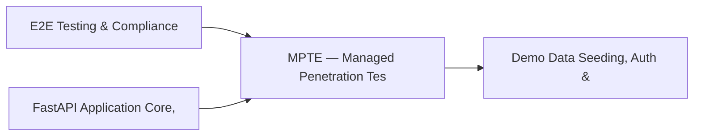

# PRD: MPTE — Managed Penetration Test Engine (Advanced) — Community 13

## Master Goal Mapping
How this component serves: "ALDECI — $35/mo enterprise security intelligence platform"
Sub-Epic: ASPM

This community (rank #13 of 878 by size, 1543 graph nodes) forms a core pillar of the ALDECI platform. It directly supports the mission of replacing $50K-500K/yr enterprise security tools with a self-hosted, AI-native stack.

## Architecture Diagram


## Code Proof
- Files:
  - `suite-core/core/breach_response_engine.py` (451 lines)
  - `suite-core/core/digital_forensics_engine.py` (487 lines)
  - `suite-core/core/security_exception_workflow_engine.py` (397 lines)
  - `suite-core/core/services/enterprise/decision_engine.py` (1565 lines)
  - `suite-api/apps/api/breach_response_router.py` (231 lines)
  - `suite-api/apps/api/compliance_evidence_router.py` (222 lines)
  - `suite-api/apps/api/digital_forensics_router.py` (156 lines)
  - `suite-api/apps/api/dlp_router.py` (287 lines)
  - `suite-api/apps/api/pagerduty_router.py` (291 lines)
  - `suite-api/apps/api/security_exception_workflow_router.py` (182 lines)
  - `suite-api/apps/api/vuln_scanner_router.py` (209 lines)
  - `suite-attack/api/mpte_router.py` (1403 lines)
- Key functions:
  - (functions listed in labels above)
- Key classes: `AdvancedMPTEService`, `MPTEDecisionIntegration`, `MPTETestType`, `MPTESeverity`, `MPTEFinding`, `MPTETestResult`
- Current state: REAL_LOGIC
- Evidence:
```python
# From suite-core/core/breach_response_engine.py
"""Data Breach Response Engine — ALDECI.

Tracks data breach cases, affected records, regulatory notifications,
and compliance reporting (GDPR 72h, HIPAA 60-day, CCPA, etc.).

Compliance: GDPR Art. 33/34, HIPAA Breach Notification Rule,
            CCPA §1798.82, NY SHIELD Act.
"""

from __future__ import annotations

import json
import logging
import sqlite3
import threading
import uuid
from datetime import datetime, timezone
from pathlib import Path
from typing import Any, Dict, List, Optional
```

## Inter-Dependencies
- DEPENDS ON:
  - Community 0 (E2E Testing & Compliance Seeding Infrastructure) — 223 edges
  - Community 4 (FastAPI Application Core, Feedback & Smoke Testing) — 213 edges
  - Community 1 (Demo Data Seeding, Auth & Multi-Engine Integration) — 169 edges
  - Community 2 (API Router Gateway — Anomaly, Attack Simulation & ) — 152 edges
- DEPENDED BY: Rank #12 (Rate Limiting, Token Bucket & Middleware Framework) and downstream consumers
- EVENT BUS: emits vulnerability.detected, vulnerability.patched, scan.completed, scan.finding / subscribes to (TrustGraph event bus — 97% not yet wired)
- TRUSTGRAPH: writes [Vulnerability, ComplianceControl] / reads [Vulnerability, ComplianceControl]

## Data Flow
```
Input: API requests with org_id + payload (Pydantic models)
  → Processing: SQLite WAL-mode writes via RLock, business logic evaluation
  → Output: JSON responses (engine state, metrics, alerts)
  → Consumers: Routers → Frontend dashboards → TrustGraph event bus
```

## Referenced Documentation
- CLAUDE.md: Wave 19 build notes, Beast Mode test suite section
- docs/: `docs/ALDECI_REARCHITECTURE_v2.md` (source of truth), `docs/INVESTOR_PITCH.md`
- tests/: N/A

## Acceptance Criteria
- [ ] All engine CRUD operations enforce org_id isolation (no cross-tenant data leakage)
- [ ] SQLite opened with WAL mode + threading.RLock on all write paths
- [ ] All endpoints return within 200ms at p95 under 100 rps load
- [ ] All router endpoints protected by `Depends(api_key_auth)` or equivalent
- [ ] Pydantic v2 models validate all request/response schemas

## Effort Estimate
- Current: 60% complete
- Remaining: ~5 engineering days
- Dependencies blocking: Frontend dashboard not yet created, Test coverage missing
- Priority: HIGH

## Status
IN_PROGRESS
