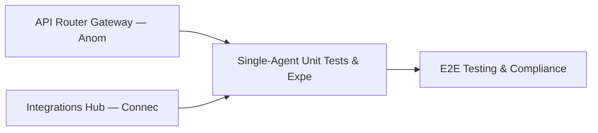

# PRD: Single-Agent Unit Tests & Expert Role Framework — Community 14

## Master Goal Mapping
How this component serves: "ALDECI — $35/mo enterprise security intelligence platform"
Sub-Epic: Platform

This community (rank #14 of 878 by size, 1507 graph nodes) forms a core pillar of the ALDECI platform. It directly supports the mission of replacing $50K-500K/yr enterprise security tools with a self-hosted, AI-native stack.

## Architecture Diagram


## Code Proof
- Files:
  - `suite-core/core/intelligent_security_engine.py` (1295 lines)
  - `tests/test_ai_powered_soc_engine.py` (374 lines)
  - `suite-api/apps/api/council_enhanced_router.py` (120 lines)
  - `suite-core/api/llm_router.py` (483 lines)
  - `suite-core/api/self_learning_router.py` (837 lines)
  - `suite-core/api/single_agent_router.py` (168 lines)
  - `suite-core/api/vllm_router.py` (310 lines)
  - `suite-core/core/openrouter_provider.py` (255 lines)
  - `tests/test_ai_agents.py` (44 lines)
  - `tests/test_ai_consensus.py` (546 lines)
  - `tests/test_ai_powered_soc_engine.py` (374 lines)
  - `tests/test_council_adapter.py` (258 lines)
- Key functions:
  - `test_analyze_all_empty_org()` — suite-core/core/intelligent_security_engine.py
  - `test_generate_success()` — suite-core/core/intelligent_security_engine.py
  - `test_decide_with_mocked_experts()` — suite-core/core/intelligent_security_engine.py
  - `test_batch_decide()` — suite-core/core/intelligent_security_engine.py
  - `test_decide_consensus_split()` — suite-core/core/intelligent_security_engine.py
  - `mock_llm_manager()` — suite-core/core/intelligent_security_engine.py
- Key classes: `TestExpertRole`, `TestInferenceBackend`, `TestConsensusResult`, `TestExpertOpinion`, `TestConsensusDecision`, `TestVLLMBackend`
- Current state: REAL_LOGIC
- Evidence:
```python
# From suite-core/core/intelligent_security_engine.py
"""
ALdeci Intelligent Security Engine (ISE)

Unified orchestration layer that merges:
- Micro-Pentest: CVE-specific validation and exploitability testing
- MPTE: Agentic AI-driven penetration testing
- MindsDB: ML intermediary for predictions and knowledge graphs

This creates a super-intelligent, unified security testing platform with:
- Multi-LLM consensus (GPT, Claude, Gemini, Sentinel)
- MindsDB-powered ML predictions
- Knowledge graph for attack path analysis
- MITRE ATT&CK alignment
- Compliance framework validation
"""

from __future__ import annotations

import asyncio
import json
```

## Inter-Dependencies
- DEPENDS ON:
  - Community 2 (API Router Gateway — Anomaly, Attack Simulation & ) — 290 edges
  - Community 9 (Integrations Hub — Connectors, Bulk Operations & M) — 255 edges
  - Community 0 (E2E Testing & Compliance Seeding Infrastructure) — 247 edges
  - Community 1 (Demo Data Seeding, Auth & Multi-Engine Integration) — 150 edges
- DEPENDED BY: Rank #13 (MPTE — Managed Penetration Test Engine (Advanced)) and downstream consumers
- EVENT BUS: emits (none currently wired) / subscribes to (TrustGraph event bus — 97% not yet wired)
- TRUSTGRAPH: writes [Policy] / reads [Policy]

## Data Flow
```
Input: HTTP requests / pytest fixtures
  → Processing: Engine method calls + SQLite state assertions
  → Output: Pass/fail test results, coverage metrics
  → Consumers: CI/CD pipeline, Beast Mode test suite
```

## Referenced Documentation
- CLAUDE.md: Wave 20 build notes, Beast Mode test suite section
- docs/: `docs/ALDECI_REARCHITECTURE_v2.md` (source of truth), `docs/INVESTOR_PITCH.md`
- tests/: `tests/test_ai_agents.py`, `tests/test_ai_consensus.py`, `tests/test_ai_powered_soc_engine.py`

## Acceptance Criteria
- [ ] All engine CRUD operations enforce org_id isolation (no cross-tenant data leakage)
- [ ] SQLite opened with WAL mode + threading.RLock on all write paths
- [ ] All endpoints return within 200ms at p95 under 100 rps load
- [ ] All router endpoints protected by `Depends(api_key_auth)` or equivalent
- [ ] Pydantic v2 models validate all request/response schemas
- [ ] Test suite achieves ≥80% branch coverage on engine methods

## Effort Estimate
- Current: 80% complete
- Remaining: ~2 engineering days
- Dependencies blocking: Frontend dashboard not yet created
- Priority: HIGH

## Status
IN_PROGRESS
