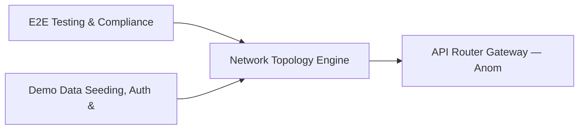

# PRD: Network Topology Engine — Community 15

## Master Goal Mapping
How this component serves: "ALDECI — $35/mo enterprise security intelligence platform"
Sub-Epic: Network

This community (rank #15 of 878 by size, 1506 graph nodes) forms a core pillar of the ALDECI platform. It directly supports the mission of replacing $50K-500K/yr enterprise security tools with a self-hosted, AI-native stack.

## Architecture Diagram


## Code Proof
- Files:
  - `suite-core/core/attack_path_engine.py` (597 lines)
  - `suite-core/core/attack_simulation_engine.py` (1585 lines)
  - `suite-core/core/graphrag_engine.py` (534 lines)
  - `suite-core/core/insider_threat_engine.py` (584 lines)
  - `suite-api/apps/api/attack_path_router.py` (195 lines)
  - `suite-api/apps/api/cloud_graph_router.py` (246 lines)
  - `suite-api/apps/api/ndr_router.py` (187 lines)
  - `suite-api/apps/api/network_topology_router.py` (236 lines)
  - `suite-api/apps/api/queue_router.py` (70 lines)
  - `suite-api/apps/api/triage_router.py` (911 lines)
  - `suite-api/apps/api/webhook_dlq_router.py` (232 lines)
  - `suite-core/api/algorithmic_router.py` (618 lines)
- Key functions:
  - `test_add_node_returns_dict()` — suite-core/core/attack_path_engine.py
  - `test_add_node_defaults()` — suite-core/core/attack_path_engine.py
  - `test_add_node_invalid_type_defaults()` — suite-core/core/attack_path_engine.py
  - `test_add_node_invalid_criticality_defaults()` — suite-core/core/attack_path_engine.py
  - `test_add_node_tags_stored()` — suite-core/core/attack_path_engine.py
  - `test_list_nodes_empty()` — suite-core/core/attack_path_engine.py
  - `test_list_nodes_returns_all()` — suite-core/core/attack_path_engine.py
  - `test_list_nodes_filter_type()` — suite-core/core/attack_path_engine.py
- Key classes: `TestNodeType`, `TestEdgeType`, `TestGraphNode`
- Current state: REAL_LOGIC
- Evidence:
```python
# From suite-core/core/attack_path_engine.py
"""Attack path analysis — graph-based lateral movement path discovery.

SQLite-backed engine for modeling attack paths through a network.
Given an entry point (compromised host), finds all paths an attacker
could take to reach crown jewel assets using known vulnerabilities
and network topology.
"""
from __future__ import annotations

import json
import sqlite3
import uuid
from collections import deque
from pathlib import Path
from typing import Optional

import structlog

_logger = structlog.get_logger()
```

## Inter-Dependencies
- DEPENDS ON:
  - Community 0 (E2E Testing & Compliance Seeding Infrastructure) — 256 edges
  - Community 1 (Demo Data Seeding, Auth & Multi-Engine Integration) — 73 edges
  - Community 2 (API Router Gateway — Anomaly, Attack Simulation & ) — 44 edges
  - Community 3 (MCP Integration Layer & API Key / Auth Management) — 32 edges
- DEPENDED BY: Rank #14 (Single-Agent Unit Tests & Expert Role Framework) and downstream consumers
- EVENT BUS: emits vulnerability.detected, vulnerability.patched / subscribes to (TrustGraph event bus — 97% not yet wired)
- TRUSTGRAPH: writes [Vulnerability, ThreatActor, NetworkAsset] / reads [NetworkAsset, CloudResource]

## Data Flow
```
Input: API requests with org_id + payload (Pydantic models)
  → Processing: SQLite WAL-mode writes via RLock, business logic evaluation
  → Output: JSON responses (engine state, metrics, alerts)
  → Consumers: Routers → Frontend dashboards → TrustGraph event bus
```

## Referenced Documentation
- CLAUDE.md: Wave 21 build notes, Beast Mode test suite section
- docs/: `docs/ALDECI_REARCHITECTURE_v2.md` (source of truth), `docs/INVESTOR_PITCH.md`
- tests/: N/A

## Acceptance Criteria
- [ ] All engine CRUD operations enforce org_id isolation (no cross-tenant data leakage)
- [ ] SQLite opened with WAL mode + threading.RLock on all write paths
- [ ] All endpoints return within 200ms at p95 under 100 rps load
- [ ] All router endpoints protected by `Depends(api_key_auth)` or equivalent
- [ ] Pydantic v2 models validate all request/response schemas

## Effort Estimate
- Current: 60% complete
- Remaining: ~5 engineering days
- Dependencies blocking: Frontend dashboard not yet created, Test coverage missing
- Priority: MEDIUM

## Status
IN_PROGRESS
