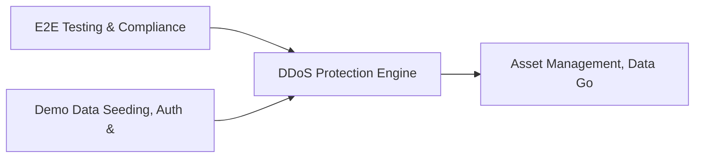

# PRD: DDoS Protection Engine — Community 16

## Master Goal Mapping
How this component serves: "ALDECI — $35/mo enterprise security intelligence platform"
Sub-Epic: Network

This community (rank #16 of 878 by size, 1466 graph nodes) forms a core pillar of the ALDECI platform. It directly supports the mission of replacing $50K-500K/yr enterprise security tools with a self-hosted, AI-native stack.

## Architecture Diagram


## Code Proof
- Files:
  - `suite-core/core/bandwidth_analysis_engine.py` (407 lines)
  - `suite-core/core/cloud_security_analytics_engine.py` (461 lines)
  - `suite-core/core/deception_engine.py` (457 lines)
  - `suite-core/core/log_management_engine.py` (378 lines)
  - `suite-core/core/threat_geolocation_engine.py` (445 lines)
  - `suite-core/core/threat_intelligence_confidence_engine.py` (414 lines)
  - `suite-core/core/wireless_security_engine.py` (316 lines)
  - `suite-api/apps/api/api_security_mgmt_router.py` (200 lines)
  - `suite-api/apps/api/attack_chain_router.py` (204 lines)
  - `suite-api/apps/api/bandwidth_analysis_router.py` (192 lines)
  - `suite-api/apps/api/cloud_security_analytics_router.py` (241 lines)
  - `suite-api/apps/api/ddos_protection_router.py` (203 lines)
- Key functions:
  - `db_path()` — suite-core/core/bandwidth_analysis_engine.py
  - `engine()` — suite-core/core/bandwidth_analysis_engine.py
  - `org()` — suite-core/core/bandwidth_analysis_engine.py
  - `other_org()` — suite-core/core/bandwidth_analysis_engine.py
  - `resource()` — suite-core/core/bandwidth_analysis_engine.py
  - `test_get_attack_stats_empty()` — suite-core/core/bandwidth_analysis_engine.py
  - `fips()` — suite-core/core/bandwidth_analysis_engine.py
  - `key()` — suite-core/core/bandwidth_analysis_engine.py
- Key classes: `TestRegisterProtectedResource`, `TestListProtectedResources`, `TestRecordAttackEvent`, `TestListAttackEvents`, `TestUpdateAttackStatus`, `TestCreateMitigationRule`
- Current state: REAL_LOGIC
- Evidence:
```python
# From suite-core/core/bandwidth_analysis_engine.py
"""Bandwidth Analysis Engine — ALDECI.

Tracks network links, utilization samples, QoS policies, and anomaly detection.
Multi-tenant via org_id.  SQLite WAL + threading.RLock for concurrency safety.
"""

from __future__ import annotations

import logging
import sqlite3
import threading
import uuid
from datetime import datetime, timezone
from pathlib import Path
from typing import Any, Dict, List, Optional

try:
    from core.trustgraph_event_bus import get_event_bus as _get_tg_bus
except ImportError:
    _get_tg_bus = None
```

## Inter-Dependencies
- DEPENDS ON:
  - Community 0 (E2E Testing & Compliance Seeding Infrastructure) — 316 edges
  - Community 1 (Demo Data Seeding, Auth & Multi-Engine Integration) — 68 edges
  - Community 8 (Asset Management, Data Governance & Risk Calculato) — 48 edges
  - Community 34 (Threat Intelligence Fusion & Confidence Engine) — 38 edges
- DEPENDED BY: Rank #15 (Network Topology Engine) and downstream consumers
- EVENT BUS: emits (none currently wired) / subscribes to (TrustGraph event bus — 97% not yet wired)
- TRUSTGRAPH: writes [ThreatActor, CloudResource] / reads [ThreatActor, CloudResource]

## Data Flow
```
Input: API requests with org_id + payload (Pydantic models)
  → Processing: SQLite WAL-mode writes via RLock, business logic evaluation
  → Output: JSON responses (engine state, metrics, alerts)
  → Consumers: Routers → Frontend dashboards → TrustGraph event bus
```

## Referenced Documentation
- CLAUDE.md: Wave 22 build notes, Beast Mode test suite section
- docs/: `docs/ALDECI_REARCHITECTURE_v2.md` (source of truth), `docs/INVESTOR_PITCH.md`
- tests/: N/A

## Acceptance Criteria
- [ ] All engine CRUD operations enforce org_id isolation (no cross-tenant data leakage)
- [ ] SQLite opened with WAL mode + threading.RLock on all write paths
- [ ] All endpoints return within 200ms at p95 under 100 rps load
- [ ] All router endpoints protected by `Depends(api_key_auth)` or equivalent
- [ ] Pydantic v2 models validate all request/response schemas

## Effort Estimate
- Current: 60% complete
- Remaining: ~5 engineering days
- Dependencies blocking: Frontend dashboard not yet created, Test coverage missing
- Priority: MEDIUM

## Status
IN_PROGRESS
