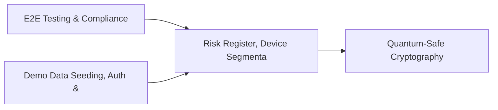

# PRD: Risk Register, Device Segmentation & Isolation Tests — Community 17

## Master Goal Mapping
How this component serves: "ALDECI — $35/mo enterprise security intelligence platform"
Sub-Epic: GRC

This community (rank #17 of 878 by size, 1445 graph nodes) forms a core pillar of the ALDECI platform. It directly supports the mission of replacing $50K-500K/yr enterprise security tools with a self-hosted, AI-native stack.

## Architecture Diagram


## Code Proof
- Files:
  - `suite-api/apps/api/risk_register_engine_router.py` (165 lines)
  - `suite-core/core/ai_security_advisor_engine.py` (963 lines)
  - `suite-core/core/compliance_automation_engine.py` (376 lines)
  - `suite-core/core/cyber_threat_modeling_engine.py` (495 lines)
  - `suite-core/core/privacy_impact_assessment_engine.py` (517 lines)
  - `suite-core/core/security_gap_analysis_engine.py` (591 lines)
  - `suite-api/apps/api/ai_security_advisor_router.py` (222 lines)
  - `suite-api/apps/api/asset_risk_calculator_router.py` (164 lines)
  - `suite-api/apps/api/bulk_router.py` (1297 lines)
  - `suite-api/apps/api/cloud_compliance_router.py` (224 lines)
  - `suite-api/apps/api/compliance_gap_router.py` (258 lines)
  - `suite-api/apps/api/compliance_scanner_router.py` (170 lines)
- Key functions:
  - `test_list_risks_org_isolation()` — suite-api/apps/api/risk_register_engine_router.py
  - `test_list_risks_filter_by_status()` — suite-api/apps/api/risk_register_engine_router.py
  - `engine()` — suite-api/apps/api/risk_register_engine_router.py
  - `_make_questionnaire()` — suite-api/apps/api/risk_register_engine_router.py
  - `_make_question()` — suite-api/apps/api/risk_register_engine_router.py
  - `_make_assessment()` — suite-api/apps/api/risk_register_engine_router.py
  - `test_risk_level_low_boundary()` — suite-api/apps/api/risk_register_engine_router.py
  - `test_risk_level_low_above()` — suite-api/apps/api/risk_register_engine_router.py
- Key classes: `TestCreateModel`, `TestRiskLevelMatrix`, `TestAttackTree`, `TestMitigate`
- Current state: REAL_LOGIC
- Evidence:
```python
# From suite-api/apps/api/risk_register_engine_router.py
"""Risk Register Engine Router — ALDECI.

Endpoints for the RiskRegisterEngine (SQLite-backed, org_id isolated).

Prefix: /api/v1/risk-register-engine
Auth:   api_key_auth dependency

Routes:
  POST  /api/v1/risk-register-engine/risks                       create_risk
  GET   /api/v1/risk-register-engine/risks                       list_risks
  GET   /api/v1/risk-register-engine/risks/{risk_id}             get_risk
  PATCH /api/v1/risk-register-engine/risks/{risk_id}/status      update_risk_status
  POST  /api/v1/risk-register-engine/risks/{risk_id}/treatments  add_risk_treatment
  GET   /api/
```

## Inter-Dependencies
- DEPENDS ON:
  - Community 0 (E2E Testing & Compliance Seeding Infrastructure) — 220 edges
  - Community 1 (Demo Data Seeding, Auth & Multi-Engine Integration) — 66 edges
  - Community 29 (Quantum-Safe Cryptography & PKI Management) — 20 edges
  - Community 35 (Cloud Security Analytics & CloudDrift Engine) — 14 edges
- DEPENDED BY: Rank #16 (DDoS Protection Engine) and downstream consumers
- EVENT BUS: emits threat.detected, threat.mitigated / subscribes to (TrustGraph event bus — 97% not yet wired)
- TRUSTGRAPH: writes [Asset, ThreatActor, ComplianceControl] / reads [ComplianceControl, CloudResource]

## Data Flow
```
Input: HTTP requests / pytest fixtures
  → Processing: Engine method calls + SQLite state assertions
  → Output: Pass/fail test results, coverage metrics
  → Consumers: CI/CD pipeline, Beast Mode test suite
```

## Referenced Documentation
- CLAUDE.md: Wave 23 build notes, Beast Mode test suite section
- docs/: `docs/ALDECI_REARCHITECTURE_v2.md` (source of truth), `docs/INVESTOR_PITCH.md`
- tests/: `suite-core/core/pentest_manager.py`

## Acceptance Criteria
- [ ] All engine CRUD operations enforce org_id isolation (no cross-tenant data leakage)
- [ ] SQLite opened with WAL mode + threading.RLock on all write paths
- [ ] All endpoints return within 200ms at p95 under 100 rps load
- [ ] All router endpoints protected by `Depends(api_key_auth)` or equivalent
- [ ] Pydantic v2 models validate all request/response schemas
- [ ] Test suite achieves ≥80% branch coverage on engine methods

## Effort Estimate
- Current: 80% complete
- Remaining: ~2 engineering days
- Dependencies blocking: Frontend dashboard not yet created
- Priority: MEDIUM

## Status
IN_PROGRESS
