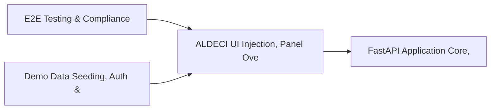

# PRD: ALDECI UI Injection, Panel Overlay & Rebrand System — Community 18

## Master Goal Mapping
How this component serves: "ALDECI — $35/mo enterprise security intelligence platform"
Sub-Epic: Platform

This community (rank #18 of 878 by size, 1389 graph nodes) forms a core pillar of the ALDECI platform. It directly supports the mission of replacing $50K-500K/yr enterprise security tools with a self-hosted, AI-native stack.

## Architecture Diagram


## Code Proof
- Files:
  - `suite-api/apps/api/policy_engine_router.py` (283 lines)
  - `suite-core/core/graphrag_engine.py` (534 lines)
  - `suite-api/apps/api/auth_router.py` (285 lines)
  - `suite-api/apps/api/deployment_router.py` (200 lines)
  - `suite-api/apps/api/policy_engine_router.py` (283 lines)
  - `suite-api/apps/api/policy_router.py` (216 lines)
  - `suite-core/simulations/experiments/ide/vscode/extension/src/vulnerabilityProvider.ts` (116 lines)
- Key functions:
  - `waitForApp()` — suite-api/apps/api/policy_engine_router.py
  - `createPanel()` — suite-api/apps/api/policy_engine_router.py
  - `init()` — suite-api/apps/api/policy_engine_router.py
  - `rebrand()` — suite-api/apps/api/policy_engine_router.py
  - `run_trivy_scan()` — suite-api/apps/api/policy_engine_router.py
  - `verify_sigstore_signature()` — suite-api/apps/api/policy_engine_router.py
  - `evaluate_policy()` — suite-api/apps/api/policy_engine_router.py
  - `list_supported_tools()` — suite-api/apps/api/policy_engine_router.py
- Key classes: `GitHubComment`, `GitHubCIAdapter`, `JenkinsCIAdapter`, `SonarQubeAdapter`, `ScanRequest`, `PolicyEvalRequest`
- Current state: REAL_LOGIC
- Evidence:
```python
# From suite-api/apps/api/policy_engine_router.py
"""
Policy Engine REST API — 12 endpoints.

Provides CRUD, evaluation, testing, bulk import/export, history, and stats
for the ALDECI policy-as-code engine.

Prefix: /api/v1/policy-engine
Tags:   policy-engine
"""

from __future__ import annotations

import logging
from typing import Any, Dict, List, Optional

from fastapi import APIRouter, Depends, HTTPException, Query
from pydantic import BaseModel, Field

from apps.api.auth_deps import api_key_auth
from apps.api.dependencies import get_org_id
```

## Inter-Dependencies
- DEPENDS ON:
  - Community 0 (E2E Testing & Compliance Seeding Infrastructure) — 244 edges
  - Community 1 (Demo Data Seeding, Auth & Multi-Engine Integration) — 207 edges
  - Community 4 (FastAPI Application Core, Feedback & Smoke Testing) — 70 edges
  - Community 9 (Integrations Hub — Connectors, Bulk Operations & M) — 26 edges
- DEPENDED BY: Rank #17 (Risk Register, Device Segmentation & Isolation Tests) and downstream consumers
- EVENT BUS: emits vulnerability.detected, vulnerability.patched, policy.violated, policy.enforced / subscribes to (TrustGraph event bus — 97% not yet wired)
- TRUSTGRAPH: writes [Vulnerability, Identity, Policy] / reads [Identity, Policy]

## Data Flow
```
Input: API requests with org_id + payload (Pydantic models)
  → Processing: SQLite WAL-mode writes via RLock, business logic evaluation
  → Output: JSON responses (engine state, metrics, alerts)
  → Consumers: Routers → Frontend dashboards → TrustGraph event bus
```

## Referenced Documentation
- CLAUDE.md: Wave 24 build notes, Beast Mode test suite section
- docs/: `docs/ALDECI_REARCHITECTURE_v2.md` (source of truth), `docs/INVESTOR_PITCH.md`
- tests/: N/A

## Acceptance Criteria
- [ ] All engine CRUD operations enforce org_id isolation (no cross-tenant data leakage)
- [ ] SQLite opened with WAL mode + threading.RLock on all write paths
- [ ] All endpoints return within 200ms at p95 under 100 rps load
- [ ] All router endpoints protected by `Depends(api_key_auth)` or equivalent
- [ ] Pydantic v2 models validate all request/response schemas
- [ ] Dashboard renders without errors in React 19 + Vite 6 + Tailwind v4

## Effort Estimate
- Current: 80% complete
- Remaining: ~2 engineering days
- Dependencies blocking: Test coverage missing
- Priority: MEDIUM

## Status
IN_PROGRESS
