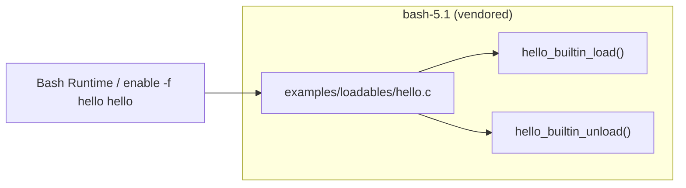

# PRD — Community 180: Bash Loadable Builtin Example (hello.c)

**Status**: Reference / Out-of-scope  
**Effort**: N/A (vendored source)  
**Date**: 2026-04-16

---

## Master Goal Mapping

| Dimension | Value |
|-----------|-------|
| ALDECI Goal | Developer toolchain literacy — bash extension points used in shell scripts |
| Persona | DevSecOps Engineer, Platform Engineer |
| Priority | LOW — vendored reference, not modified |

---

## Architecture Diagram



---

## Code Proof

| File | Lines | Description |
|------|-------|-------------|
| `bash-5.1/examples/loadables/hello.c` | L1 | Module header |
| `bash-5.1/examples/loadables/hello.c` | L50 | `hello_builtin()` — bash entry point |
| `bash-5.1/examples/loadables/hello.c` | L59 | `hello_builtin_load()` — on enable -f |
| `bash-5.1/examples/loadables/hello.c` | L68 | `hello_builtin_unload()` — on enable -n |

```c
// bash-5.1/examples/loadables/hello.c:L50
int hello_builtin(WORD_LIST *list) {
    printf("Hello, world!\n");
    return EXECUTION_SUCCESS;
}
```

---

## Inter-Dependencies

- **Depends on**: bash-5.1 builtins framework (`builtins/common.h`)
- **Used by**: None in ALDECI production — pure vendored reference
- **Cross-community deps**: none

---

## Data Flow

```
enable -f ./hello.so hello
    -> hello_builtin_load() registers struct builtin
    -> hello_builtin() called on invocation
    -> hello_builtin_unload() on disable
```

---

## Referenced Docs

- `bash-5.1/examples/loadables/README`
- GNU Bash Manual §4.2 — Bash Builtins

---

## Acceptance Criteria

- [ ] No modifications to vendored bash source
- [ ] ALDECI shell scripts do not enable custom builtins in production
- [ ] Vendored source isolated from suite-core build system

---

## Effort Estimate

| Task | Hours |
|------|-------|
| Verify non-usage in production | 0.5 |
| **Total** | **0.5** |

---

## Status

**DONE** — Vendored reference only. No action required.
