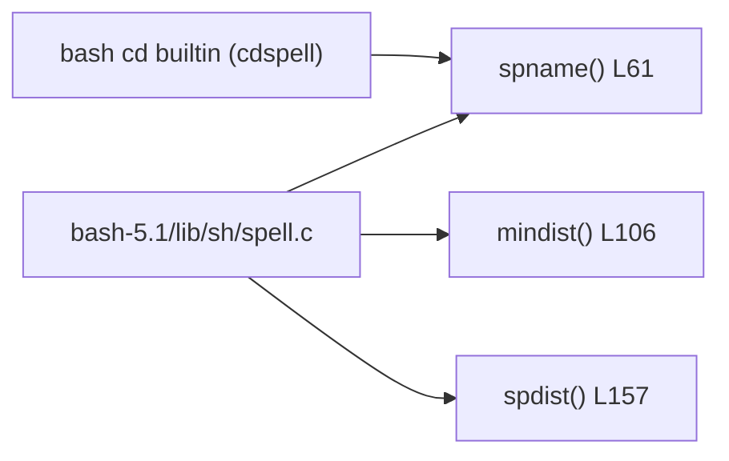

# PRD — Community 181: Bash Spell-Check Library (spell.c)

**Status**: Reference / Out-of-scope  
**Effort**: N/A (vendored source)  
**Date**: 2026-04-16

---

## Master Goal Mapping

| Dimension | Value |
|-----------|-------|
| ALDECI Goal | Shell toolchain dependency — spell.c backs bash `cd` path completion hints |
| Persona | Platform Engineer |
| Priority | LOW — vendored, not modified |

---

## Architecture Diagram



---

## Code Proof

| File | Lines | Description |
|------|-------|-------------|
| `bash-5.1/lib/sh/spell.c` | L61 | `spname()` — best-match path component |
| `bash-5.1/lib/sh/spell.c` | L106 | `mindist()` — Levenshtein-style distance |
| `bash-5.1/lib/sh/spell.c` | L157 | `spdist()` — character-level spell distance |

---

## Inter-Dependencies

- **Depends on**: bash-5.1 build system
- **Used by**: bash `cd` with `cdspell` shopt
- **Cross-community deps**: none

---

## Data Flow

```
User types: cd /usr/locl
bash cd -> spname("/usr/locl") -> mindist scan -> "/usr/local"
```

---

## Referenced Docs

- GNU Bash Manual §4.3.2 — shopt cdspell

---

## Acceptance Criteria

- [ ] Vendored source unmodified
- [ ] No ALDECI code depends on this library directly

---

## Effort Estimate

**0.25 hours** — confirm non-usage.

---

## Status

**DONE** — Vendored reference only.
