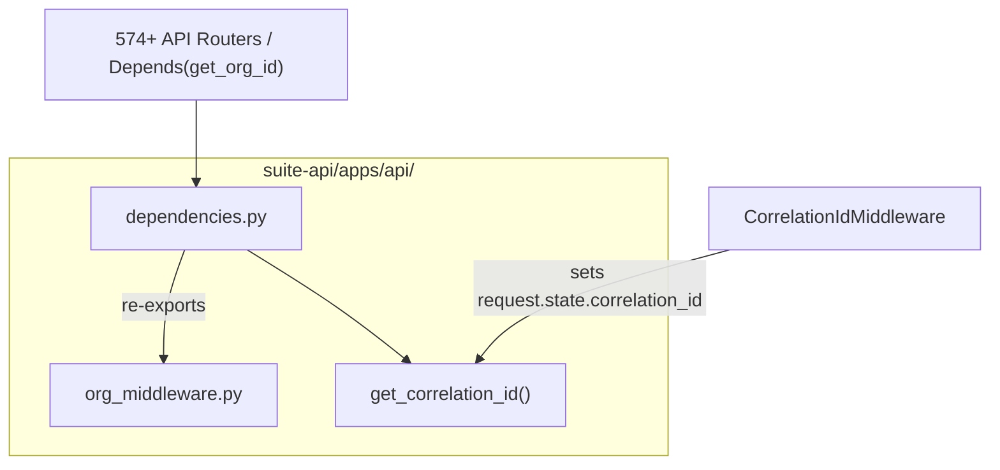

# PRD — Community 182: FastAPI Shared Dependencies (dependencies.py)

**Status**: DONE — Production  
**Effort**: Ongoing  
**Date**: 2026-04-16

---

## Master Goal Mapping

| Dimension | Value |
|-----------|-------|
| ALDECI Goal | Multi-tenant isolation + distributed tracing across all 574+ API routers |
| Persona | All 30 personas (auth gateway) |
| Priority | CRITICAL — foundational to every endpoint |

---

## Architecture Diagram



---

## Code Proof

| File | Lines | Description |
|------|-------|-------------|
| `suite-api/apps/api/dependencies.py` | L1–10 | Docstring — multi-tenancy + tracing purpose |
| `suite-api/apps/api/dependencies.py` | L17–23 | Re-exports from `org_middleware` (single source of truth) |
| `suite-api/apps/api/dependencies.py` | L25–37 | `get_correlation_id(request)` |

```python
# suite-api/apps/api/dependencies.py:L25
def get_correlation_id(request: Request) -> Optional[str]:
    """Extract correlation_id from request state (set by CorrelationIdMiddleware)."""
    return getattr(request.state, "correlation_id", None)

__all__ = ["get_org_id", "get_org_id_required", "get_current_org_id", "get_correlation_id"]
```

---

## Inter-Dependencies

- **Depends on**: `apps/api/org_middleware.py` (single source of truth for org_id resolution)
- **Used by**: All 574+ router files via `Depends(get_org_id)`
- **Cross-community deps**: Referenced by virtually every router community

---

## Data Flow

```
HTTP Request
    -> CorrelationIdMiddleware sets request.state.correlation_id
    -> org_middleware.get_org_id() reads X-Org-Id header / JWT claim
    -> Router Handler: Depends(get_org_id) + Depends(get_correlation_id)
    -> Engine.method(org_id=org_id) -> SQLite WHERE org_id = ?
```

---

## Referenced Docs

- `docs/ALDECI_REARCHITECTURE_v2.md` section: Multi-Tenancy
- `suite-api/apps/api/org_middleware.py`

---

## Acceptance Criteria

- [x] `get_org_id` re-exported from `org_middleware`
- [x] `get_org_id_required` raises 422 if org_id missing
- [x] `get_correlation_id` returns None gracefully when middleware not active
- [x] All 574+ routers import from `dependencies.py`
- [ ] Unit test: `test_get_correlation_id_missing` returns None
- [ ] Unit test: `test_get_org_id_required_raises` on empty header

---

## Effort Estimate

| Task | Hours |
|------|-------|
| Add missing unit tests | 2 |
| **Total** | **2** |

---

## Status

**PRODUCTION** — Core dependency in production. Unit tests recommended.
