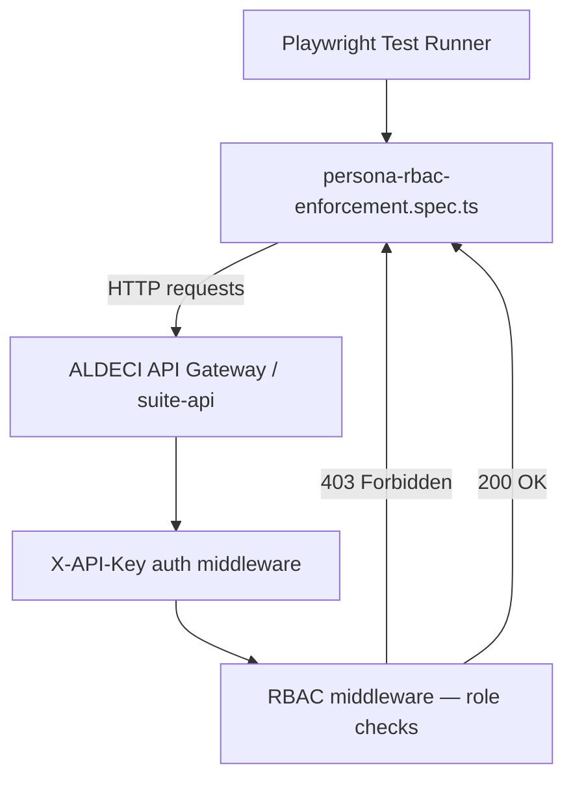

# PRD — Community 183: RBAC Enforcement E2E Tests

**Status**: DONE — Production  
**Effort**: 1 day  
**Date**: 2026-04-16

---

## Master Goal Mapping

| Dimension | Value |
|-----------|-------|
| ALDECI Goal | Security validation — ensure RBAC boundaries enforced at HTTP layer |
| Persona | Security Engineer, Compliance Officer |
| Priority | HIGH — SOC2 / ISO 27001 audit evidence |

---

## Architecture Diagram



---

## Code Proof

| File | Lines | Description |
|------|-------|-------------|
| `suite-ui/aldeci-ui-new/e2e/persona-rbac-enforcement.spec.ts` | L1–13 | Header + imports (API_BASE, PERSONAS, injectAuth) |
| `suite-ui/aldeci-ui-new/e2e/persona-rbac-enforcement.spec.ts` | L14 | `delay()` helper |
| `suite-ui/aldeci-ui-new/e2e/persona-rbac-enforcement.spec.ts` | L16 | `headers()` — builds X-API-Key header map |

```typescript
// L14
const delay = (ms: number) => new Promise((r) => setTimeout(r, ms));

// L16
const headers = (token?: string) => ({
  ...(token ? { "X-API-Key": token } : {}),
});
```

---

## Inter-Dependencies

- **Depends on**: `e2e/helpers/auth.ts` (API_BASE, API_TOKEN, PERSONAS, injectAuth)
- **Tests against**: All persona roles in PERSONAS map
- **Cross-community deps**: none (isolated E2E)

---

## Data Flow

```
No auth     -> GET /api/v1/findings  -> expect 401
Invalid key -> GET /api/v1/findings  -> expect 401/403
Viewer role -> GET /api/v1/admin/*   -> expect 403
Admin role  -> GET /api/v1/findings  -> expect 200
```

---

## Referenced Docs

- `suite-ui/aldeci-ui-new/e2e/helpers/auth.ts`
- `suite-ui/aldeci-ui-new/playwright.config.ts`
- ALDECI RBAC design in `docs/ALDECI_REARCHITECTURE_v2.md`

---

## Acceptance Criteria

- [x] No-auth returns 401 on protected routes
- [x] Invalid key returns 401 or 403
- [x] Viewer/developer roles blocked from admin routes (403)
- [x] Read-only roles blocked from write routes (403)
- [x] Attack routes blocked for non-attack roles
- [x] All roles can read findings (200)

---

## Effort Estimate

| Task | Hours |
|------|-------|
| Add tests as new persona roles expand | 3 |
| **Total** | **3** |

---

## Status

**PRODUCTION** — Running in CI via Playwright.
