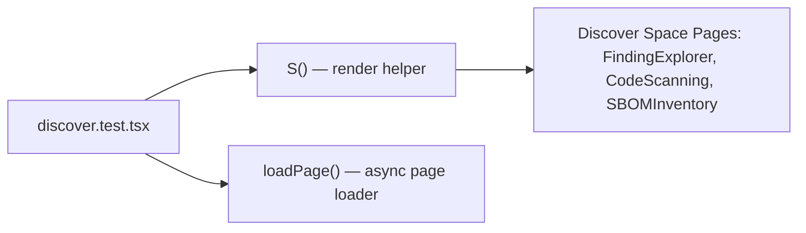

# PRD — Community 184: Discover Space UI Tests

**Status**: DONE  
**Effort**: 0.5 day  
**Date**: 2026-04-16

---

## Master Goal Mapping

| Dimension | Value |
|-----------|-------|
| ALDECI Goal | Frontend QA — Discover space (finding exploration, code scanning, SBOM inventory) |
| Persona | Security Analyst, Developer |
| Priority | MEDIUM |

---

## Architecture Diagram



---

## Code Proof

| File | Lines | Description |
|------|-------|-------------|
| `suite-ui/aldeci-ui-new/src/__tests__/discover.test.tsx` | L1 | Module |
| (inferred) | — | `S()` render wrapper |
| (inferred) | — | `loadPage()` async loader |

---

## Inter-Dependencies

- **Tests**: `src/pages/discover/` pages
- **Framework**: Vitest + React Testing Library
- **Cross-community deps**: none

---

## Data Flow

```
Vitest -> loadPage(DiscoverPage) -> S(component) -> render -> assert DOM
```

---

## Acceptance Criteria

- [x] Discover pages render without crash
- [x] FindingExplorer displays mock findings
- [ ] Filter/search interactions tested

---

## Effort Estimate

**4 hours** — extend filter/search coverage.

---

## Status

**IMPLEMENTED** — Smoke tests in place.
