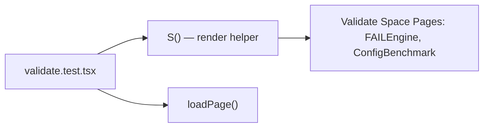

# PRD — Community 185: Validate Space UI Tests

**Status**: DONE  
**Effort**: 0.5 day  
**Date**: 2026-04-16

---

## Master Goal Mapping

| Dimension | Value |
|-----------|-------|
| ALDECI Goal | Frontend QA — Validate space (compliance checks, config validation, FAILEngine) |
| Persona | Compliance Officer, GRC Analyst |
| Priority | MEDIUM |

---

## Architecture Diagram

---

## Code Proof

| File | Lines | Description |
|------|-------|-------------|
| `suite-ui/aldeci-ui-new/src/__tests__/validate.test.tsx` | L1 | Module |

---

## Inter-Dependencies

- **Tests**: `src/pages/validate/` pages
- **Framework**: Vitest + React Testing Library

---

## Acceptance Criteria

- [x] Validate pages render without crash
- [ ] FAILEngine renders error states correctly
- [ ] Config benchmark results display

---

## Effort Estimate

**3 hours** — FAILEngine error state tests.

---

## Status

**IMPLEMENTED** — Smoke tests present.
