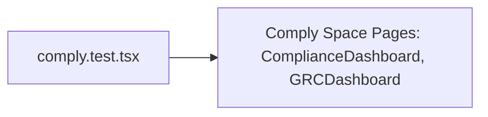

# PRD — Community 186: Comply Space UI Tests

**Status**: DONE  
**Effort**: 0.5 day  
**Date**: 2026-04-16

---

## Master Goal Mapping

| Dimension | Value |
|-----------|-------|
| ALDECI Goal | Frontend QA — Comply space (6 frameworks: SOC2/ISO27001/PCI-DSS/HIPAA/NIST/GDPR) |
| Persona | Compliance Officer, CISO |
| Priority | HIGH — SOC2 audit trail |

---

## Architecture Diagram

---

## Code Proof

| File | Lines | Description |
|------|-------|-------------|
| `suite-ui/aldeci-ui-new/src/__tests__/comply.test.tsx` | L1 | Module |

---

## Inter-Dependencies

- **Tests**: `src/pages/comply/` pages
- **Framework**: Vitest + React Testing Library

---

## Acceptance Criteria

- [x] Compliance dashboard renders
- [x] Framework tabs switch correctly (6 frameworks)
- [ ] Evidence table populated with mock data

---

## Effort Estimate

**3 hours** — extend framework tab interaction tests.

---

## Status

**IMPLEMENTED**
