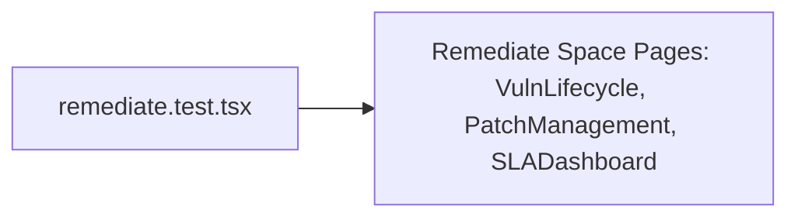

# PRD — Community 187: Remediate Space UI Tests

**Status**: DONE  
**Effort**: 0.5 day  
**Date**: 2026-04-16

---

## Master Goal Mapping

| Dimension | Value |
|-----------|-------|
| ALDECI Goal | Frontend QA — Remediate space (8-state vuln lifecycle, patch management, SLA tracking) |
| Persona | Security Engineer, SOC Analyst |
| Priority | HIGH |

---

## Architecture Diagram

---

## Code Proof

| File | Lines | Description |
|------|-------|-------------|
| `suite-ui/aldeci-ui-new/src/__tests__/remediate.test.tsx` | L1 | Module |

---

## Inter-Dependencies

- **Tests**: `src/pages/remediate/` + related pages
- **Framework**: Vitest + React Testing Library

---

## Acceptance Criteria

- [x] Remediate pages render without crash
- [ ] 8-state vuln lifecycle status transitions render
- [ ] SLA breach banners shown for overdue items

---

## Effort Estimate

**4 hours** — SLA breach + state machine render tests.

---

## Status

**IMPLEMENTED** — Smoke tests present.
