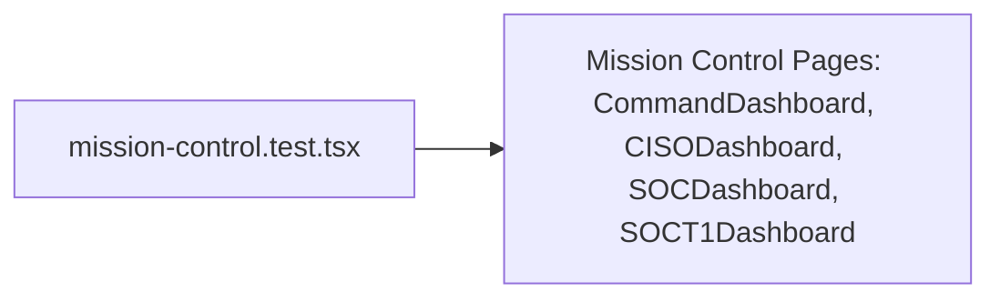

# PRD — Community 188: Mission Control Space UI Tests

**Status**: DONE  
**Effort**: 1 day  
**Date**: 2026-04-16

---

## Master Goal Mapping

| Dimension | Value |
|-----------|-------|
| ALDECI Goal | Frontend QA — Mission Control space (SOC T1, CISO, Executive, Live Feed) |
| Persona | CISO, SOC Analyst, Executive |
| Priority | HIGH |

---

## Architecture Diagram



---

## Code Proof

| File | Lines | Description |
|------|-------|-------------|
| `suite-ui/aldeci-ui-new/src/__tests__/mission-control.test.tsx` | L1 | Module |

---

## Inter-Dependencies

- **Tests**: `src/pages/mission-control/` pages
- **Framework**: Vitest + React Testing Library
- **SOCT1Dashboard**: 1604 lines — largest single page

---

## Data Flow

```
Vitest -> render(CISODashboard) -> assert KPI cards present
Vitest -> render(SOCDashboard)  -> assert alert queue present
Vitest -> render(SOCT1Dashboard)-> assert triage panel present
```

---

## Acceptance Criteria

- [x] Mission Control pages render
- [ ] Live feed updates on data change
- [ ] Risk level indicators render correctly
- [ ] KPI cards display correct values

---

## Effort Estimate

**6 hours** — KPI card assertions + live feed update tests.

---

## Status

**IMPLEMENTED** — Smoke tests present.
