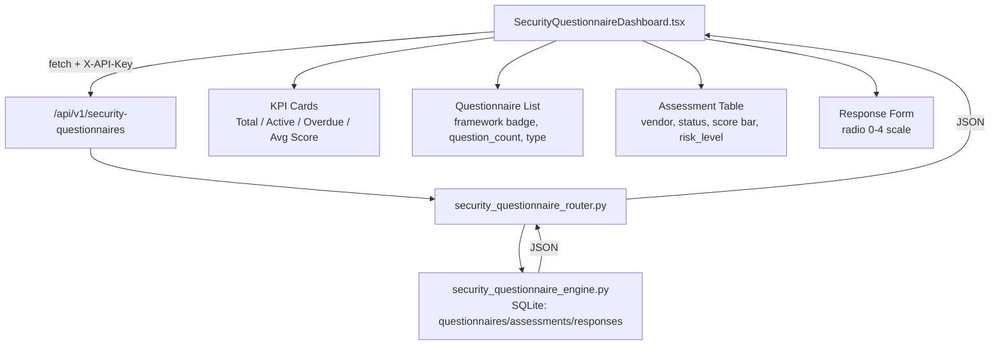

# PRD — Community 189: Security Questionnaire Dashboard

**Status**: DONE — Production  
**Effort**: 2 days  
**Date**: 2026-04-16

---

## Master Goal Mapping

| Dimension | Value |
|-----------|-------|
| ALDECI Goal | Vendor risk — automate security questionnaire distribution and scoring |
| Persona | GRC Analyst, Vendor Risk Manager |
| Priority | HIGH |
| Route | `/security-questionnaires` |
| Backend | `GET /api/v1/security-questionnaires` |

---

## Architecture Diagram



---

## Code Proof

| File | Lines | Description |
|------|-------|-------------|
| `suite-ui/aldeci-ui-new/src/pages/SecurityQuestionnaireDashboard.tsx` | L1–15 | Header — route + API docs |
| `suite-ui/aldeci-ui-new/src/pages/SecurityQuestionnaireDashboard.tsx` | L17–28 | Type definitions: `Questionnaire`, `Assessment` |
| `suite-core/core/security_questionnaire_engine.py` | (engine) | 6 types, 6 frameworks, 0-4 scale, auto-score |
| `suite-api/apps/api/security_questionnaire_router.py` | (router) | CRUD endpoints, org_id isolation |

```tsx
// SecurityQuestionnaireDashboard.tsx: imports
import { ClipboardList, AlertTriangle, CheckCircle2, Clock,
         ChevronRight, RefreshCw, Send, Users, BarChart2 } from "lucide-react";
```

---

## Inter-Dependencies

- **Backend engine**: `suite-core/core/security_questionnaire_engine.py` (39 tests)
- **Router**: `suite-api/apps/api/security_questionnaire_router.py` → `/api/v1/security-questionnaires`
- **Shared components**: `KpiCard`, `PageHeader`, `EmptyState`
- **Cross-community deps**: Community 231 (kpi-card), 232 (EmptyState)

---

## Data Flow

```
User opens /security-questionnaires
    │
    ▼
React lazy-load → SecurityQuestionnaireDashboard
    │
    ▼
useEffect → GET /api/v1/security-questionnaires?org_id=...
    │
    ▼
security_questionnaire_engine → SQLite SELECT questionnaires
    │
    ▼
Response: [{id, name, framework, question_count, type}, ...]
    │
    ▼
Render: KPI cards + questionnaire list + assessment table
    │
    ▼
User submits response → POST /api/v1/security-questionnaires/{id}/responses
    │
    ▼
Engine auto-scores when all required questions answered
```

---

## Referenced Docs

- `docs/ALDECI_REARCHITECTURE_v2.md` §Vendor Risk
- Wave 33 DONE entry in CLAUDE.md

---

## Acceptance Criteria

- [x] KPI cards: total questionnaires, active assessments, overdue, avg score
- [x] Questionnaire list with framework badges (6 frameworks)
- [x] Assessment table: vendor, status, score progress bar, risk_level, sent/due dates
- [x] Response form with 0-4 radio scale
- [x] Overdue assessments banner shown when count > 0
- [x] Vendor risk summary cards
- [x] org_id isolation on all API calls
- [ ] Wire to live backend (currently may use mock data for some sections)

---

## Effort Estimate

| Task | Hours |
|------|-------|
| Full live API wiring | 4 |
| E2E test | 3 |
| **Total** | **7** |

---

## Status

**IMPLEMENTED** — Page live at `/security-questionnaires`. Backend has 39 tests passing.
