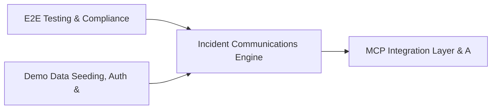

# PRD: Incident Communications Engine — Community 19

## Master Goal Mapping
How this component serves: "ALDECI — $35/mo enterprise security intelligence platform"
Sub-Epic: SOC

This community (rank #19 of 878 by size, 1371 graph nodes) forms a core pillar of the ALDECI platform. It directly supports the mission of replacing $50K-500K/yr enterprise security tools with a self-hosted, AI-native stack.

## Architecture Diagram


## Code Proof
- Files:
  - `suite-core/core/incident_comms_engine.py` (437 lines)
  - `suite-core/core/security_tabletop_engine.py` (433 lines)
  - `suite-api/apps/api/analytics_dashboard_router.py` (179 lines)
  - `suite-api/apps/api/analytics_router.py` (1231 lines)
  - `suite-api/apps/api/auto_pentest_router.py` (219 lines)
  - `suite-api/apps/api/ciso_report_router.py` (103 lines)
  - `suite-api/apps/api/compliance_reports_router.py` (177 lines)
  - `suite-api/apps/api/dashboard_builder_router.py` (319 lines)
  - `suite-api/apps/api/exec_security_reports_router.py` (199 lines)
  - `suite-api/apps/api/executive_report_router.py` (180 lines)
  - `suite-api/apps/api/auto_pentest_router.py` (219 lines)
  - `tests/test_auto_pentest.py` (786 lines)
- Key functions:
  - `engine()` — suite-core/core/incident_comms_engine.py
  - `draft_comm()` — suite-core/core/incident_comms_engine.py
  - `slack_comm()` — suite-core/core/incident_comms_engine.py
  - `test_init_idempotent()` — suite-core/core/incident_comms_engine.py
  - `test_create_comm_returns_record()` — suite-core/core/incident_comms_engine.py
  - `test_create_comm_requires_subject()` — suite-core/core/incident_comms_engine.py
  - `test_create_comm_requires_body()` — suite-core/core/incident_comms_engine.py
  - `test_create_comm_invalid_comm_type()` — suite-core/core/incident_comms_engine.py
- Key classes: `TestWeeklyBrief`, `TestExecutiveSummary`, `TestExportMarkdown`, `TestExportJson`, `TestRiskPostureDelta`, `TestGracefulDegradation`
- Current state: REAL_LOGIC
- Evidence:
```python
# From suite-core/core/incident_comms_engine.py
"""Incident Communications Engine — ALDECI.

Manages all communications during security incidents: initial notifications,
status updates, resolutions, post-mortems, stakeholder briefs, and press
releases. Supports templates, acknowledgment tracking, and delivery metrics.

Compliance: NIST CSF RS.CO-1, ISO/IEC 27001 A.16.1.6, SOC 2 CC7.4
"""

from __future__ import annotations

import json
import logging
import sqlite3
import threading
import uuid
from datetime import datetime, timezone
from pathlib import Path
from typing import Any, Dict, List, Optional
```

## Inter-Dependencies
- DEPENDS ON:
  - Community 0 (E2E Testing & Compliance Seeding Infrastructure) — 209 edges
  - Community 1 (Demo Data Seeding, Auth & Multi-Engine Integration) — 63 edges
  - Community 3 (MCP Integration Layer & API Key / Auth Management) — 49 edges
  - Community 20 (Secrets Management & API Gateway Security) — 43 edges
- DEPENDED BY: Rank #18 (ALDECI UI Injection, Panel Overlay & Rebrand System) and downstream consumers
- EVENT BUS: emits incident.opened, incident.closed, vulnerability.detected, vulnerability.patched / subscribes to (TrustGraph event bus — 97% not yet wired)
- TRUSTGRAPH: writes [Vulnerability, Incident, ComplianceControl] / reads [Incident, ComplianceControl]

## Data Flow
```
Input: HTTP requests / pytest fixtures
  → Processing: Engine method calls + SQLite state assertions
  → Output: Pass/fail test results, coverage metrics
  → Consumers: CI/CD pipeline, Beast Mode test suite
```

## Referenced Documentation
- CLAUDE.md: Wave 25 build notes, Beast Mode test suite section
- docs/: `docs/ALDECI_REARCHITECTURE_v2.md` (source of truth), `docs/INVESTOR_PITCH.md`
- tests/: `suite-api/apps/api/auto_pentest_router.py`, `tests/test_auto_pentest.py`, `tests/test_autofix_templates.py`

## Acceptance Criteria
- [ ] All engine CRUD operations enforce org_id isolation (no cross-tenant data leakage)
- [ ] SQLite opened with WAL mode + threading.RLock on all write paths
- [ ] All endpoints return within 200ms at p95 under 100 rps load
- [ ] All router endpoints protected by `Depends(api_key_auth)` or equivalent
- [ ] Pydantic v2 models validate all request/response schemas
- [ ] Test suite achieves ≥80% branch coverage on engine methods

## Effort Estimate
- Current: 80% complete
- Remaining: ~2 engineering days
- Dependencies blocking: Frontend dashboard not yet created
- Priority: MEDIUM

## Status
IN_PROGRESS
