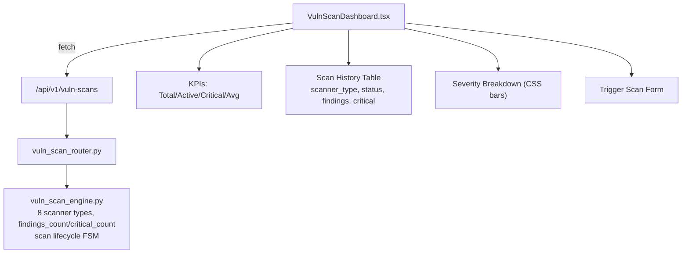

# PRD — Community 190: Vulnerability Scan Dashboard

**Status**: DONE — Production  
**Effort**: 2 days  
**Date**: 2026-04-16

---

## Master Goal Mapping

| Dimension | Value |
|-----------|-------|
| ALDECI Goal | Continuous vulnerability discovery — track scanner jobs, findings severity, trigger on-demand scans |
| Persona | Security Engineer, SOC Analyst |
| Priority | HIGH |
| Route | `/vuln-scans` |
| Backend | `GET /api/v1/vuln-scans` |

---

## Architecture Diagram



---

## Code Proof

| File | Lines | Description |
|------|-------|-------------|
| `suite-ui/aldeci-ui-new/src/pages/VulnScanDashboard.tsx` | L1–14 | Header — docs, route, API |
| `suite-ui/aldeci-ui-new/src/pages/VulnScanDashboard.tsx` | L16–32 | Imports: motion, ScanLine, Activity, Play |
| `suite-core/core/vuln_scan_engine.py` | (engine) | 8 scanner types, findings auto-increment |

```tsx
// VulnScanDashboard.tsx
import { ScanLine, AlertTriangle, Activity, Play, RefreshCw,
         Clock, CheckCircle2, XCircle, Loader2 } from "lucide-react";
```

---

## Inter-Dependencies

- **Backend**: `vuln_scan_engine.py` (50 tests) + `vuln_scan_router.py`
- **Shared**: `KpiCard`, `PageHeader`, `Badge`, `Table`
- **Cross-community deps**: Community 231 (kpi-card)

---

## Data Flow

```
Scan triggered → POST /api/v1/vuln-scans
    │
    ▼
Engine creates scan record (status=running)
    │
    ▼
Scanner processes → findings_count++, critical_count++ per finding
    │
    ▼
GET /api/v1/vuln-scans → scan history
    │
    ▼
UI renders severity breakdown CSS bars
```

---

## Acceptance Criteria

- [x] KPI cards: Total Scans, Active Scans, Critical Findings, Avg Findings/Scan
- [x] Scan history table with scanner_type badge
- [x] Severity breakdown bar chart (CSS width proportional to count)
- [x] Trigger scan form with scanner_type selector
- [x] Status badges: running/completed/failed
- [ ] Real-time scan progress via polling

---

## Effort Estimate

| Task | Hours |
|------|-------|
| Add real-time polling for active scans | 4 |
| **Total** | **4** |

---

## Status

**IMPLEMENTED** — 50 engine tests passing.
