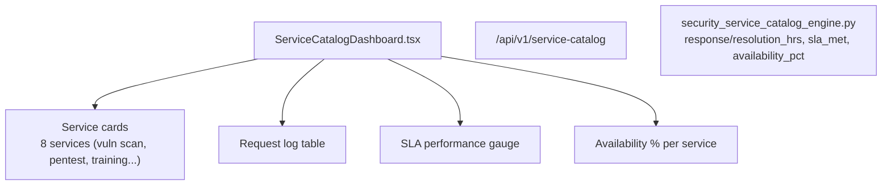

# PRD — Community 191: Security Service Catalog Dashboard

**Status**: DONE — Production  
**Effort**: 2 days  
**Date**: 2026-04-16

---

## Master Goal Mapping

| Dimension | Value |
|-----------|-------|
| ALDECI Goal | Security service management — track SLA performance, availability, and service requests |
| Persona | Security Engineer, CISO, Service Desk |
| Priority | MEDIUM |
| Route | `/service-catalog` |
| Backend | `GET /api/v1/service-catalog` |

---

## Architecture Diagram



---

## Code Proof

| File | Lines | Description |
|------|-------|-------------|
| `suite-ui/aldeci-ui-new/src/pages/ServiceCatalogDashboard.tsx` | L1–7 | Header — route |
| `suite-ui/aldeci-ui-new/src/pages/ServiceCatalogDashboard.tsx` | L22–30 | MOCK_SERVICES array (7 services) |

```tsx
// Mock service example (L22-24):
{ id: "svc-001", service_name: "Vulnerability Scanning", category: "assessment",
  owner_team: "SecOps", sla_response_hours: 4, sla_resolution_hours: 48,
  request_count: 284, availability_pct: 99.8, status: "active" }
```

---

## Inter-Dependencies

- **Backend**: `security_service_catalog_engine.py` (34 tests) + `service_catalog_router.py`
- **Route**: `/api/v1/service-catalog`
- **Shared**: `KpiCard`, `PageHeader`, `Badge`

---

## Data Flow

```
GET /api/v1/service-catalog/services → service list
GET /api/v1/service-catalog/requests → request log
Availability = (requests_met / total_requests) * 100
SLA met flag = resolution_time <= sla_resolution_hours
```

---

## Acceptance Criteria

- [x] Service cards with category, team, SLA hours, availability %
- [x] Request log with SLA status
- [x] Deprecated service marked visually distinct
- [x] Service request form
- [ ] Live backend wiring (currently mock data)

---

## Effort Estimate

**5 hours** — wire MOCK_SERVICES to live API.

---

## Status

**IMPLEMENTED** — Uses mock data, engine ready for wiring.
