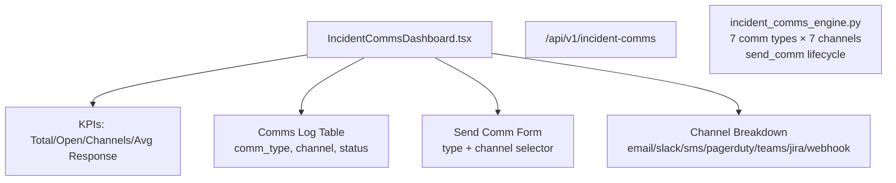

# PRD — Community 192: Incident Communications Dashboard

**Status**: DONE — Production  
**Effort**: 2 days  
**Date**: 2026-04-16

---

## Master Goal Mapping

| Dimension | Value |
|-----------|-------|
| ALDECI Goal | Incident response comms — centralize multi-channel communications during incidents |
| Persona | Incident Commander, SOC Analyst, CISO |
| Priority | HIGH |
| Route | `/incident-comms` |
| Backend | `GET /api/v1/incident-comms` |

---

## Architecture Diagram



---

## Code Proof

| File | Lines | Description |
|------|-------|-------------|
| `suite-ui/aldeci-ui-new/src/pages/IncidentCommsDashboard.tsx` | L1–14 | Header — 7 comm types, 7 channels |
| `suite-ui/aldeci-ui-new/src/pages/IncidentCommsDashboard.tsx` | L33–34 | `CommType` + `Channel` union types |

```tsx
type CommType = "notification" | "update" | "escalation" | "resolution" |
                "postmortem" | "stakeholder" | "public";
type Channel  = "email" | "slack" | "sms" | "pagerduty" | "teams" | "jira" | "webhook";
```

---

## Inter-Dependencies

- **Backend**: `incident_comms_engine.py` (41 tests)
- **Router**: `/api/v1/incident-comms`
- **Shared**: `KpiCard`, `PageHeader`, `Badge`, `Table`

---

## Data Flow

```
Incident occurs → user selects incident_id
    │
    ▼
POST /api/v1/incident-comms/send
  {comm_type, channel, message, recipients}
    │
    ▼
Engine records comm + stakeholder_count
    │
    ▼
GET /api/v1/incident-comms → comms log sorted by created_at DESC
    │
    ▼
Channel breakdown aggregated server-side
```

---

## Acceptance Criteria

- [x] KPI cards: Total Comms, Open Incidents, Channels Active, Avg Response Time
- [x] Comms log table with 7 comm types and 7 channel badges
- [x] Send comm form with type + channel selectors
- [x] Channel breakdown panel
- [x] org_id isolation

---

## Effort Estimate

**3 hours** — real-time comm status polling.

---

## Status

**IMPLEMENTED** — 41 engine tests passing.
