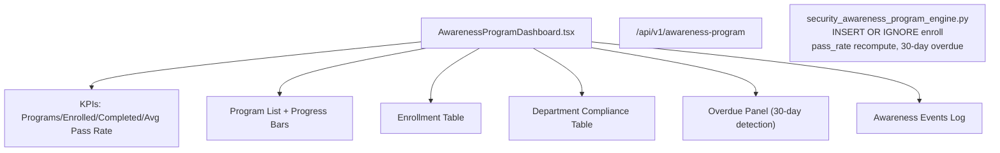

# PRD — Community 193: Security Awareness Program Dashboard

**Status**: DONE — Production  
**Effort**: 2 days  
**Date**: 2026-04-16

---

## Master Goal Mapping

| Dimension | Value |
|-----------|-------|
| ALDECI Goal | Security culture — track awareness program enrollment, completion, and compliance by department |
| Persona | Security Awareness Manager, CISO, HR |
| Priority | HIGH |
| Route | `/awareness-program` |
| Backend | `GET /api/v1/awareness-program` |

---

## Architecture Diagram



---

## Code Proof

| File | Lines | Description |
|------|-------|-------------|
| `suite-ui/aldeci-ui-new/src/pages/AwarenessProgramDashboard.tsx` | L29–36 | MOCK_PROGRAMS array |

```tsx
// Program types: mandatory/simulation/compliance/role-based
{ id: "prg-001", program_name: "Annual Security Awareness",
  type: "mandatory", frequency: "annual",
  enrolled: 820, completed: 781, pass_rate: 94, status: "active" }
```

---

## Inter-Dependencies

- **Backend**: `security_awareness_program_engine.py` (43 tests)
- **Router**: `/api/v1/awareness-program`
- **Engine features**: INSERT OR IGNORE enroll, pass_rate = completed/enrolled, 30-day overdue detection

---

## Data Flow

```
GET /api/v1/awareness-program/programs → 6 program types
GET /api/v1/awareness-program/enrollments?overdue=true → overdue list
POST /api/v1/awareness-program/enroll → INSERT OR IGNORE
POST /api/v1/awareness-program/complete → updates pass_rate
```

---

## Acceptance Criteria

- [x] Programs list with frequency badges + progress bars
- [x] Enrollment table with completion status
- [x] Department compliance table
- [x] Overdue enrollments panel (30-day detection)
- [x] Awareness events log
- [x] Duplicate enrollment prevention (INSERT OR IGNORE)

---

## Effort Estimate

**4 hours** — wire mock data to live API.

---

## Status

**IMPLEMENTED** — 43 engine tests passing.
