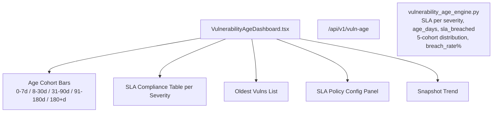

# PRD — Community 194: Vulnerability Age Dashboard

**Status**: DONE — Production  
**Effort**: 2 days  
**Date**: 2026-04-16

---

## Master Goal Mapping

| Dimension | Value |
|-----------|-------|
| ALDECI Goal | SLA accountability — expose vulnerability age distribution and SLA breach rates by severity |
| Persona | Security Engineer, CISO, Compliance Officer |
| Priority | HIGH |
| Route | `/vuln-age` |
| Backend | `GET /api/v1/vuln-age` |

---

## Architecture Diagram



---

## Code Proof

| File | Lines | Description |
|------|-------|-------------|
| `suite-ui/aldeci-ui-new/src/pages/VulnerabilityAgeDashboard.tsx` | L16–22 | AGE_COHORTS with color mapping |
| `suite-ui/aldeci-ui-new/src/pages/VulnerabilityAgeDashboard.tsx` | L24 | MOCK_SLA per severity |

```tsx
const AGE_COHORTS = [
  { label: "0–7d",    count: 124, color: "bg-green-500"  },
  { label: "8–30d",   count: 287, color: "bg-yellow-500" },
  { label: "31–90d",  count: 412, color: "bg-orange-500" },
  { label: "91–180d", count: 198, color: "bg-red-500"    },
  { label: "180+d",   count: 93,  color: "bg-red-700"    },
];
```

---

## Inter-Dependencies

- **Backend**: `vulnerability_age_engine.py` (39 tests)
- **Router**: `/api/v1/vuln-age`
- **SLA days**: critical=3, high=14, medium=30, low=90

---

## Data Flow

```
Engine: age_days = julianday('now') - julianday(created_at)
sla_days per severity: critical=3, high=14, medium=30, low=90
sla_breached = age_days > sla_days
breach_rate = COUNT(breached) / COUNT(total) * 100
5 cohorts aggregated from age_days distribution
```

---

## Acceptance Criteria

- [x] 5-cohort age distribution bar chart (color-coded by severity)
- [x] SLA compliance table: severity / total / compliant / breached / SLA days
- [x] Oldest vulns list
- [x] SLA policy config panel
- [x] Breach rate % computed and displayed

---

## Effort Estimate

**3 hours** — live API wiring.

---

## Status

**IMPLEMENTED** — 39 engine tests passing.
