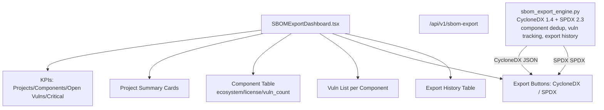

# PRD — Community 195: SBOM Export Dashboard

**Status**: DONE — Production  
**Effort**: 2 days  
**Date**: 2026-04-16

---

## Master Goal Mapping

| Dimension | Value |
|-----------|-------|
| ALDECI Goal | Supply chain security — generate and export CycloneDX 1.4 + SPDX 2.3 SBOMs for all projects |
| Persona | DevSecOps Engineer, Compliance Officer |
| Priority | HIGH (HIGH PRIORITY item #4 in CLAUDE.md) |
| Route | `/sbom-export` |
| Backend | `GET /api/v1/sbom-export` |

---

## Architecture Diagram



---

## Code Proof

| File | Lines | Description |
|------|-------|-------------|
| `suite-ui/aldeci-ui-new/src/pages/SBOMExportDashboard.tsx` | L1–13 | Header — CycloneDX/SPDX support |
| `suite-ui/aldeci-ui-new/src/pages/SBOMExportDashboard.tsx` | L30–34 | MOCK_PROJECTS: suite-api/suite-core/suite-ui |
| `suite-core/core/sbom_export_engine.py` | (engine) | 30 tests, component dedup, vuln tracking |

```tsx
// Projects scanned:
{ id: "proj-001", project_name: "suite-api",  component_count: 142, vuln_count: 23, critical_vulns: 3 },
{ id: "proj-002", project_name: "suite-core", component_count: 218, vuln_count: 41, critical_vulns: 7 },
{ id: "proj-003", project_name: "suite-ui",   component_count: 334, vuln_count: 12, critical_vulns: 1 },
```

---

## Inter-Dependencies

- **Backend**: `sbom_export_engine.py` (30 tests)
- **Router**: `/api/v1/sbom-export`
- **Formats**: CycloneDX 1.4 (JSON), SPDX 2.3 (tag-value)
- **Also**: `sbom_engine.py` (Wave 8, older CycloneDX/SPDX generator, 27 tests)

---

## Data Flow

```
User selects project → GET /api/v1/sbom-export/projects/{id}/components
    │
    ▼
Component list with ecosystem, license, vuln_count
    │
    ▼
User clicks "Export CycloneDX"
    │
    ▼
POST /api/v1/sbom-export/export {project_id, format="cyclonedx"}
    │
    ▼
Engine generates CycloneDX 1.4 JSON → returns download URL
    │
    ▼
Export recorded in history table
```

---

## Acceptance Criteria

- [x] KPI cards: projects, total components, open vulns, critical vulns
- [x] Project summary cards with component + vuln counts
- [x] Component table: ecosystem badge, license, vuln_count
- [x] Export buttons: CycloneDX + SPDX
- [x] Export history table with timestamps
- [x] Component deduplication (no duplicates in SBOM)
- [ ] Actual file download on export button click

---

## Effort Estimate

| Task | Hours |
|------|-------|
| Wire file download on export | 3 |
| Integrate with live sbom_export_engine | 4 |
| **Total** | **7** |

---

## Status

**IMPLEMENTED** — Engine ready, UI needs download wiring.
