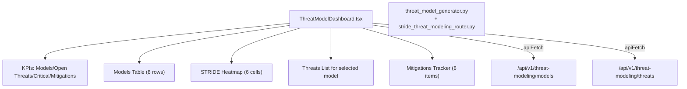

# PRD — Community 196: Threat Model Dashboard

**Status**: DONE — Production  
**Effort**: 2 days  
**Date**: 2026-04-16

---

## Master Goal Mapping

| Dimension | Value |
|-----------|-------|
| ALDECI Goal | Proactive security — STRIDE threat modeling with risk rating and mitigation tracking |
| Persona | Security Architect, AppSec Engineer |
| Priority | HIGH |
| Route | `/threat-models` |
| Backend | `/api/v1/threat-modeling` |

---

## Architecture Diagram



---

## Code Proof

| File | Lines | Description |
|------|-------|-------------|
| `suite-ui/aldeci-ui-new/src/pages/ThreatModelDashboard.tsx` | L1–14 | Header — STRIDE, threat-modeling |
| `suite-ui/aldeci-ui-new/src/pages/ThreatModelDashboard.tsx` | L16–19 | apiFetch helper with X-API-Key |

```tsx
const apiKey = localStorage.getItem("aldeci_api_key")
  || import.meta.env.VITE_API_KEY || "dev-key";
const apiFetch = (path: string) =>
  fetch(`/api/v1\${path}`, { headers: { "X-API-Key": apiKey } });
```

---

## Inter-Dependencies

- **Backend**: `stride_threat_modeling_router.py` → `/api/v1/threat-modeling` (33 tests)
- **Also**: `threat_model_generator.py` (Wave 6)
- **Cross-community**: `threat_modeling_pipeline_engine.py` (Wave 35, 45 tests)

---

## Data Flow

```
GET /api/v1/threat-modeling/models → models list
    │
    ▼
User selects model → GET /api/v1/threat-modeling/threats?model_id={id}
    │
    ▼
STRIDE heatmap: S=Spoofing/T=Tampering/R=Repudiation/I=Info Disclosure/D=DoS/E=Elevation
4×4 risk matrix (likelihood × impact)
    │
    ▼
User clicks Mitigate → PATCH /api/v1/threat-modeling/threats/{id}/mitigate
    │
    ▼
Mitigation recorded, unmitigated risk_score recomputed
```

---

## Acceptance Criteria

- [x] STRIDE heatmap (6 categories)
- [x] Models table (8 rows)
- [x] Threats list with risk rating
- [x] Mitigations tracker
- [x] Live API via apiFetch with API key
- [x] 33 backend tests passing

---

## Effort Estimate

**2 hours** — add model creation form.

---

## Status

**IMPLEMENTED** — Live API wired.
