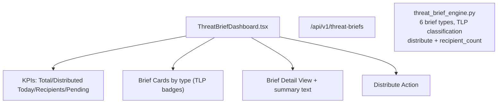

# PRD — Community 197: Threat Brief Dashboard

**Status**: DONE — Production  
**Effort**: 1.5 days  
**Date**: 2026-04-16

---

## Master Goal Mapping

| Dimension | Value |
|-----------|-------|
| ALDECI Goal | Threat intelligence distribution — create and distribute classified threat briefs to stakeholders |
| Persona | Threat Intel Analyst, CISO |
| Priority | HIGH |
| Route | `/threat-briefs` |
| Backend | `GET /api/v1/threat-briefs` |

---

## Architecture Diagram



---

## Code Proof

| File | Lines | Description |
|------|-------|-------------|
| `suite-ui/aldeci-ui-new/src/pages/ThreatBriefDashboard.tsx` | L1–13 | Header — 6 types, TLP classification |
| `suite-core/core/threat_brief_engine.py` | (engine) | 37 tests, distribute + recipient_count |

---

## Inter-Dependencies

- **Backend**: `threat_brief_engine.py` (37 tests)
- **Router**: `/api/v1/threat-briefs`
- **TLP levels**: WHITE / GREEN / AMBER / RED

---

## Data Flow

```
GET /api/v1/threat-briefs → brief cards (6 types)
    │
    ▼
User selects brief → detail view with summary
    │
    ▼
POST /api/v1/threat-briefs/{id}/distribute
    │
    ▼
Engine updates recipient_count, records distribution
```

---

## Acceptance Criteria

- [x] KPI cards (total, distributed today, recipients, pending review)
- [x] Brief cards with TLP color badges (WHITE/GREEN/AMBER/RED)
- [x] Detail view with summary text
- [x] Distribute action with recipient count update

---

## Effort Estimate

**2 hours** — brief creation form.

---

## Status

**IMPLEMENTED** — 37 engine tests passing.
