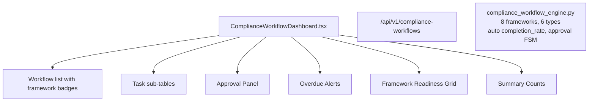

# PRD — Community 198: Compliance Workflow Dashboard

**Status**: DONE — Production  
**Effort**: 2 days  
**Date**: 2026-04-16

---

## Master Goal Mapping

| Dimension | Value |
|-----------|-------|
| ALDECI Goal | GRC automation — manage compliance workflows from task creation through approval for 8 frameworks |
| Persona | Compliance Officer, GRC Analyst, CISO |
| Priority | HIGH |
| Route | `/compliance-workflows` |
| Backend | `GET /api/v1/compliance-workflows` |

---

## Architecture Diagram



---

## Code Proof

| File | Lines | Description |
|------|-------|-------------|
| `suite-ui/aldeci-ui-new/src/pages/ComplianceWorkflowDashboard.tsx` | L1–10 | Header |
| `suite-ui/aldeci-ui-new/src/pages/ComplianceWorkflowDashboard.tsx` | L12–22 | Type definitions: Framework (8), WorkflowStatus (5) |

```tsx
type Framework = "SOC2"|"ISO27001"|"PCI-DSS"|"HIPAA"|"NIST"|"GDPR"|"CIS"|"FedRAMP";
type WorkflowStatus = "not_started"|"in_progress"|"review"|"approved"|"closed";
type TaskPriority = "critical"|"high"|"medium"|"low";
type ApprovalDecision = "approved"|"rejected"|"pending";
```

---

## Inter-Dependencies

- **Backend**: `compliance_workflow_engine.py` (36 tests)
- **FSM**: pending-approval auto-transition → approve=completed / reject=needs-rework
- **Router**: `/api/v1/compliance-workflows`

---

## Data Flow

```
GET /api/v1/compliance-workflows → workflow list (8 frameworks)
    │
    ▼
completion_rate = COUNT(completed tasks) / COUNT(total tasks) * 100
    │
    ▼
POST /api/v1/compliance-workflows/{id}/approve
    │
    ▼
Engine: status=approved if all tasks approved, else needs-rework
```

---

## Acceptance Criteria

- [x] 8 compliance framework badges
- [x] Workflow list with completion_rate progress bars
- [x] Task sub-tables per workflow
- [x] Approval panel with approve/reject
- [x] Overdue workflow alerts
- [x] Framework readiness grid

---

## Effort Estimate

**3 hours** — live API wiring.

---

## Status

**IMPLEMENTED** — 36 engine tests passing.
