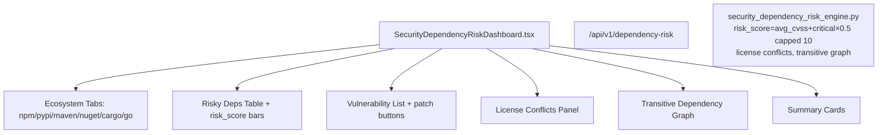

# PRD — Community 199: Security Dependency Risk Dashboard

**Status**: DONE — Production  
**Effort**: 2 days  
**Date**: 2026-04-16

---

## Master Goal Mapping

| Dimension | Value |
|-----------|-------|
| ALDECI Goal | SCA risk visibility — track risky dependencies across 6 ecosystems with transitive graph |
| Persona | DevSecOps Engineer, AppSec Engineer |
| Priority | HIGH |
| Route | `/dependency-risk` |
| Backend | `GET /api/v1/dependency-risk` |

---

## Architecture Diagram



---

## Code Proof

| File | Lines | Description |
|------|-------|-------------|
| `suite-ui/aldeci-ui-new/src/pages/SecurityDependencyRiskDashboard.tsx` | L1–12 | Header |
| `suite-ui/aldeci-ui-new/src/pages/SecurityDependencyRiskDashboard.tsx` | L14–16 | Ecosystem type + tabs array |
| `suite-ui/aldeci-ui-new/src/pages/SecurityDependencyRiskDashboard.tsx` | L18–26 | MOCK_DEPS: log4j (9.8), etc. |

```tsx
type Ecosystem = "npm" | "pypi" | "maven" | "nuget" | "cargo" | "go";
// Highest risk example:
{ package_name: "log4j-core", version: "2.14.1", ecosystem: "maven",
  risk_score: 9.8, vuln_count: 4, critical_vuln_count: 2, license: "Apache-2.0" }
```

---

## Inter-Dependencies

- **Backend**: `security_dependency_risk_engine.py` (38 tests)
- **Formula**: `risk_score = avg_cvss + critical_count * 0.5` capped at 10
- **License**: AGPL/GPL detected as conflicts
- **Transitive**: BFS graph traversal

---

## Acceptance Criteria

- [x] 6 ecosystem tabs (npm/pypi/maven/nuget/cargo/go)
- [x] Risk score bars (0-10 scale)
- [x] Vuln list with patch buttons
- [x] License conflict detection
- [x] Transitive dependency graph panel

---

## Effort Estimate

**4 hours** — transitive graph visualization.

---

## Status

**IMPLEMENTED** — 38 engine tests passing.
