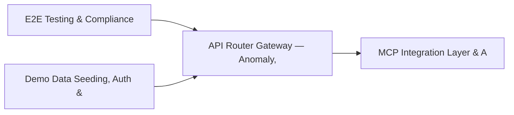

# PRD: API Router Gateway — Anomaly, Attack Simulation & Security Engines — Community 2

## Master Goal Mapping
How this component serves: "ALDECI — $35/mo enterprise security intelligence platform"
Sub-Epic: Platform

This community (rank #2 of 878 by size, 3778 graph nodes) forms a core pillar of the ALDECI platform. It directly supports the mission of replacing $50K-500K/yr enterprise security tools with a self-hosted, AI-native stack.

## Architecture Diagram


## Code Proof
- Files:
  - `suite-api/apps/api/fix_engine_router.py` (256 lines)
  - `suite-api/apps/api/anomaly_router.py` (261 lines)
  - `suite-api/apps/api/attack_simulation_router.py` (182 lines)
  - `suite-api/apps/api/compliance_gap_router.py` (258 lines)
  - `suite-api/apps/api/container_runtime_router.py` (347 lines)
  - `suite-api/apps/api/dlp_router.py` (287 lines)
  - `suite-api/apps/api/fix_engine_router.py` (256 lines)
  - `suite-api/apps/api/pr_generator_router.py` (146 lines)
  - `suite-api/apps/api/remediation_router.py` (997 lines)
  - `suite-attack/api/micro_pentest_router.py` (2029 lines)
- Key functions:
  - `_timestamp()` — suite-api/apps/api/fix_engine_router.py
  - `test_singleton_pattern()` — suite-api/apps/api/fix_engine_router.py
  - `enricher()` — suite-api/apps/api/fix_engine_router.py
  - `sample_findings()` — suite-api/apps/api/fix_engine_router.py
  - `mock_epss_response()` — suite-api/apps/api/fix_engine_router.py
  - `mock_kev_response()` — suite-api/apps/api/fix_engine_router.py
  - `normal_findings()` — suite-api/apps/api/fix_engine_router.py
  - `anomalous_findings()` — suite-api/apps/api/fix_engine_router.py
- Key classes: `Enum`, `ExploitationStatus`, `SystemExposureLevel`, `UtilityLevel`, `HumanImpactLevel`, `Priority`
- Current state: REAL_LOGIC
- Evidence:
```python
# From suite-api/apps/api/fix_engine_router.py
"""FixEngine — Remediation Workflow Engine API endpoints.

Provides playbook management and execution lifecycle endpoints:
- Create/list/get playbooks
- List built-in templates
- Execute, approve, reject, rollback, cancel executions
- List/get executions
"""

from __future__ import annotations

import logging
from typing import Any, Dict, List, Optional

from fastapi import APIRouter, HTTPException, Query
from pydantic import BaseModel

_logger = logging.getLogger(__name__)

# Lazy import of engine (graceful degradation if pydantic not available)
```

## Inter-Dependencies
- DEPENDS ON:
  - Community 0 (E2E Testing & Compliance Seeding Infrastructure) — 681 edges
  - Community 1 (Demo Data Seeding, Auth & Multi-Engine Integration) — 466 edges
  - Community 3 (MCP Integration Layer & API Key / Auth Management) — 372 edges
  - Community 4 (FastAPI Application Core, Feedback & Smoke Testing) — 347 edges
- DEPENDED BY: Rank #1 (Demo Data Seeding, Auth & Multi-Engine Integration Tests) and downstream consumers
- EVENT BUS: emits vulnerability.detected, vulnerability.patched, threat.detected, threat.mitigated / subscribes to (TrustGraph event bus — 97% not yet wired)
- TRUSTGRAPH: writes [Vulnerability, ThreatActor, Alert] / reads [Alert, Identity]

## Data Flow
```
Input: HTTP requests / pytest fixtures
  → Processing: Engine method calls + SQLite state assertions
  → Output: Pass/fail test results, coverage metrics
  → Consumers: CI/CD pipeline, Beast Mode test suite
```

## Referenced Documentation
- CLAUDE.md: Wave 8 build notes, Beast Mode test suite section
- docs/: `docs/ALDECI_REARCHITECTURE_v2.md` (source of truth), `docs/INVESTOR_PITCH.md`
- tests/: `suite-attack/api/micro_pentest_router.py`

## Acceptance Criteria
- [ ] All engine CRUD operations enforce org_id isolation (no cross-tenant data leakage)
- [ ] SQLite opened with WAL mode + threading.RLock on all write paths
- [ ] All endpoints return within 200ms at p95 under 100 rps load
- [ ] All router endpoints protected by `Depends(api_key_auth)` or equivalent
- [ ] Pydantic v2 models validate all request/response schemas
- [ ] Test suite achieves ≥80% branch coverage on engine methods

## Effort Estimate
- Current: 80% complete
- Remaining: ~2 engineering days
- Dependencies blocking: Frontend dashboard not yet created
- Priority: CRITICAL

## Status
IN_PROGRESS
