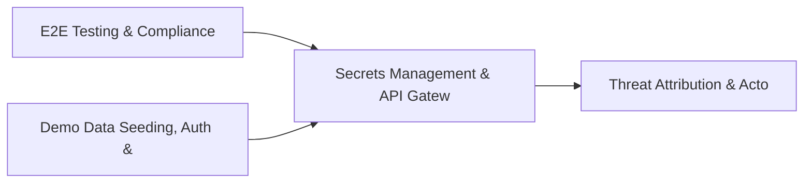

# PRD: Secrets Management & API Gateway Security — Community 20

## Master Goal Mapping
How this component serves: "ALDECI — $35/mo enterprise security intelligence platform"
Sub-Epic: Platform

This community (rank #20 of 878 by size, 1363 graph nodes) forms a core pillar of the ALDECI platform. It directly supports the mission of replacing $50K-500K/yr enterprise security tools with a self-hosted, AI-native stack.

## Architecture Diagram


## Code Proof
- Files:
  - `suite-core/core/sbom_engine.py` (799 lines)
  - `suite-api/apps/api/attack_surface_router.py` (197 lines)
  - `suite-api/apps/api/bulk_operations_router.py` (236 lines)
  - `suite-api/apps/api/container_runtime_router.py` (347 lines)
  - `suite-api/apps/api/risk_scoring_router.py` (232 lines)
  - `suite-api/apps/api/sbom_export_router.py` (183 lines)
  - `suite-api/apps/api/sbom_router.py` (180 lines)
  - `suite-api/apps/api/security_metrics_router.py` (515 lines)
  - `suite-api/apps/api/security_okr_router.py` (206 lines)
- Key functions:
  - `org()` — suite-core/core/sbom_engine.py
  - `org2()` — suite-core/core/sbom_engine.py
  - `_add_supplier()` — suite-core/core/sbom_engine.py
  - `test_add_supplier_returns_record()` — suite-core/core/sbom_engine.py
  - `test_add_supplier_invalid_category_defaults_to_software()` — suite-core/core/sbom_engine.py
  - `test_add_supplier_invalid_risk_tier_defaults_to_medium()` — suite-core/core/sbom_engine.py
  - `test_add_supplier_all_categories()` — suite-core/core/sbom_engine.py
  - `test_add_supplier_all_risk_tiers()` — suite-core/core/sbom_engine.py
- Key classes: `TestBenchmarks`
- Current state: REAL_LOGIC
- Evidence:
```python
# From suite-core/core/sbom_engine.py
"""Software Bill of Materials (SBOM) Generation Engine — ALDECI.

Generates, stores, and exports SBOMs in CycloneDX 1.4 and SPDX 2.3 formats.

Capabilities:
  - Asset and component registry (multi-tenant, org-scoped WAL SQLite)
  - Package URL (purl) auto-generation from component metadata
  - CycloneDX 1.4 JSON export with vulnerability mappings
  - SPDX 2.3 JSON export with external references
  - License risk classification (GPL→high, MIT/Apache→low, unknown→medium)
  - Vulnerability exposure analytics per org
  - Cross-org isolation — org_a data never visible from org_b

Compliance: NTIA S
```

## Inter-Dependencies
- DEPENDS ON:
  - Community 0 (E2E Testing & Compliance Seeding Infrastructure) — 271 edges
  - Community 1 (Demo Data Seeding, Auth & Multi-Engine Integration) — 74 edges
  - Community 22 (Threat Attribution & Actor Tracking Engine) — 67 edges
  - Community 36 (Evidence Vault & Security Service Catalog) — 57 edges
- DEPENDED BY: Rank #19 (Incident Communications Engine) and downstream consumers
- EVENT BUS: emits (none currently wired) / subscribes to (TrustGraph event bus — 97% not yet wired)
- TRUSTGRAPH: writes [ThreatActor, NetworkAsset] / reads [ThreatActor, NetworkAsset]

## Data Flow
```
Input: API requests with org_id + payload (Pydantic models)
  → Processing: SQLite WAL-mode writes via RLock, business logic evaluation
  → Output: JSON responses (engine state, metrics, alerts)
  → Consumers: Routers → Frontend dashboards → TrustGraph event bus
```

## Referenced Documentation
- CLAUDE.md: Wave 26 build notes, Beast Mode test suite section
- docs/: `docs/ALDECI_REARCHITECTURE_v2.md` (source of truth), `docs/INVESTOR_PITCH.md`
- tests/: N/A

## Acceptance Criteria
- [ ] All engine CRUD operations enforce org_id isolation (no cross-tenant data leakage)
- [ ] SQLite opened with WAL mode + threading.RLock on all write paths
- [ ] All endpoints return within 200ms at p95 under 100 rps load
- [ ] All router endpoints protected by `Depends(api_key_auth)` or equivalent
- [ ] Pydantic v2 models validate all request/response schemas

## Effort Estimate
- Current: 60% complete
- Remaining: ~5 engineering days
- Dependencies blocking: Frontend dashboard not yet created, Test coverage missing
- Priority: MEDIUM

## Status
IN_PROGRESS
