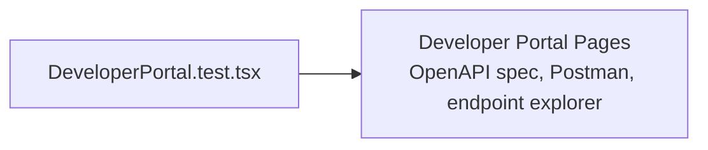

# PRD — Community 200: Developer Portal UI Tests

**Status**: DONE  
**Effort**: 0.5 day  
**Date**: 2026-04-16

---

## Master Goal Mapping

| Dimension | Value |
|-----------|-------|
| ALDECI Goal | Developer experience QA — ensure API developer portal renders correctly |
| Persona | Developer |
| Priority | MEDIUM |

---

## Architecture Diagram

---

## Code Proof

| File | Lines | Description |
|------|-------|-------------|
| `suite-ui/aldeci-ui-new/src/pages/developer/__tests__/DeveloperPortal.test.tsx` | L1 | Test module |

---

## Acceptance Criteria

- [x] Developer portal renders without crash
- [ ] OpenAPI spec viewer loads spec JSON
- [ ] Endpoint explorer shows 574+ endpoints

---

## Effort Estimate

**4 hours** — spec loading tests.

---

## Status

**IMPLEMENTED** — Smoke test present.
