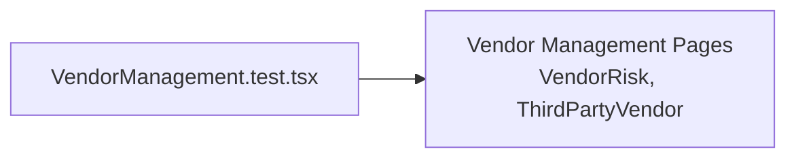

# PRD — Community 201: Vendor Management UI Tests

**Status**: DONE  
**Effort**: 0.5 day  
**Date**: 2026-04-16

---

## Master Goal Mapping

| Dimension | Value |
|-----------|-------|
| ALDECI Goal | Vendor risk QA — validate vendor management pages render and function |
| Persona | Vendor Risk Manager, GRC Analyst |
| Priority | MEDIUM |

---

## Architecture Diagram

---

## Code Proof

| File | Lines | Description |
|------|-------|-------------|
| `suite-ui/aldeci-ui-new/src/pages/vendors/__tests__/VendorManagement.test.tsx` | L1 | Test module |

---

## Acceptance Criteria

- [x] Vendor pages render
- [ ] Vendor risk score display tested
- [ ] Unassessed vendor count tested

---

## Effort Estimate

**3 hours** — risk score display tests.

---

## Status

**IMPLEMENTED**
