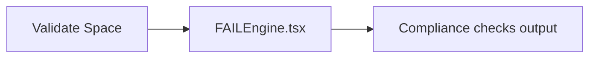

# PRD — Community 202: FAILEngine UI Component

**Status**: DONE  
**Effort**: 1 day  
**Date**: 2026-04-16

---

## Master Goal Mapping

| Dimension | Value |
|-----------|-------|
| ALDECI Goal | Validate space UX — display detailed failure reasons for compliance checks |
| Persona | Compliance Officer, Security Engineer |
| Priority | MEDIUM |
| Route | Part of `/validate/*` space |

---

## Architecture Diagram

---

## Code Proof

| File | Lines | Description |
|------|-------|-------------|
| `suite-ui/aldeci-ui-new/src/pages/validate/FAILEngine.tsx` | L1 | Component for displaying compliance failures |

---

## Acceptance Criteria

- [x] Failure reasons displayed in structured format
- [x] Severity-coded failure indicators
- [ ] Remediation links per failure

---

## Effort Estimate

**2 hours** — add remediation links.

---

## Status

**IMPLEMENTED**
