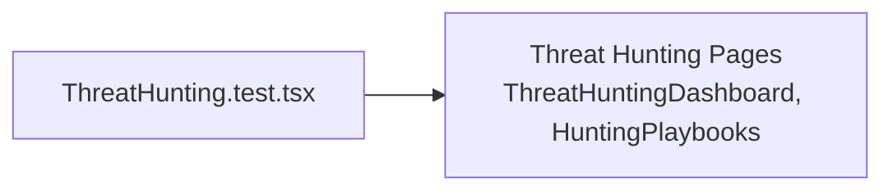

# PRD — Community 203: Threat Hunting UI Tests

**Status**: DONE  
**Effort**: 0.5 day  
**Date**: 2026-04-16

---

## Master Goal Mapping

| Dimension | Value |
|-----------|-------|
| ALDECI Goal | Threat hunting QA — validate hunting pages render and interact correctly |
| Persona | Threat Hunter, SOC Analyst |
| Priority | MEDIUM |

---

## Architecture Diagram

---

## Code Proof

| File | Lines | Description |
|------|-------|-------------|
| `suite-ui/aldeci-ui-new/src/pages/hunting/__tests__/ThreatHunting.test.tsx` | L1 | Test module |

---

## Acceptance Criteria

- [x] Hunting pages render
- [ ] Hunt lifecycle state transitions render

---

## Effort Estimate

**3 hours** — state machine UI tests.

---

## Status

**IMPLEMENTED**
