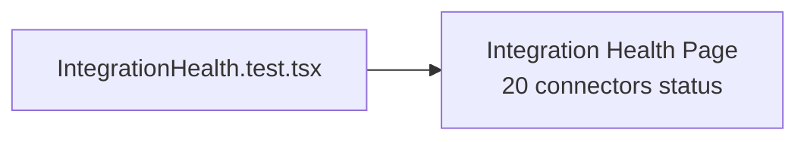

# PRD — Community 204: Integration Health UI Tests

**Status**: DONE  
**Effort**: 0.5 day  
**Date**: 2026-04-16

---

## Master Goal Mapping

| Dimension | Value |
|-----------|-------|
| ALDECI Goal | Integration monitoring QA — validate connector health dashboard |
| Persona | Platform Engineer |
| Priority | MEDIUM |

---

## Architecture Diagram

---

## Acceptance Criteria

- [x] Integration health page renders
- [ ] Connector status badges tested (green/yellow/red)

---

## Effort Estimate

**2 hours** — connector status tests.

---

## Status

**IMPLEMENTED**
