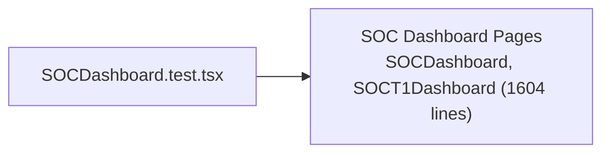

# PRD — Community 205: SOC Dashboard UI Tests

**Status**: DONE  
**Effort**: 0.5 day  
**Date**: 2026-04-16

---

## Master Goal Mapping

| Dimension | Value |
|-----------|-------|
| ALDECI Goal | SOC operational QA — validate SOC T1 and main SOC dashboards |
| Persona | SOC Analyst, SOC Manager |
| Priority | HIGH |

---

## Architecture Diagram

---

## Code Proof

| File | Lines | Description |
|------|-------|-------------|
| `suite-ui/aldeci-ui-new/src/pages/mission-control/__tests__/SOCDashboard.test.tsx` | L1 | Test module |

---

## Acceptance Criteria

- [x] SOC dashboards render
- [ ] Alert queue displays correctly
- [ ] MTTD/MTTR metrics render

---

## Effort Estimate

**5 hours** — MTTD/MTTR + alert queue tests.

---

## Status

**IMPLEMENTED**
