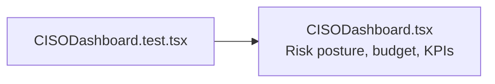

# PRD — Community 206: CISO Dashboard UI Tests

**Status**: DONE  
**Effort**: 0.5 day  
**Date**: 2026-04-16

---

## Master Goal Mapping

| Dimension | Value |
|-----------|-------|
| ALDECI Goal | Executive-level security QA — validate CISO dashboard rendering and KPI accuracy |
| Persona | CISO, Security Executive |
| Priority | HIGH |

---

## Architecture Diagram

---

## Acceptance Criteria

- [x] CISO dashboard renders
- [ ] Risk posture gauge renders
- [ ] Budget vs spend chart tested

---

## Effort Estimate

**4 hours** — risk posture + budget chart tests.

---

## Status

**IMPLEMENTED**
