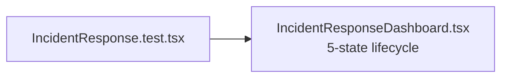

# PRD — Community 207: Incident Response UI Tests

**Status**: DONE  
**Effort**: 0.5 day  
**Date**: 2026-04-16

---

## Master Goal Mapping

| Dimension | Value |
|-----------|-------|
| ALDECI Goal | Incident management QA — validate 5-state lifecycle incident dashboard |
| Persona | Incident Commander, SOC Analyst |
| Priority | HIGH |

---

## Architecture Diagram

---

## Acceptance Criteria

- [x] Incident response page renders
- [ ] State transitions (open→contained→resolved) render
- [ ] MTTR metric displayed

---

## Effort Estimate

**4 hours** — state transition + MTTR tests.

---

## Status

**IMPLEMENTED**
