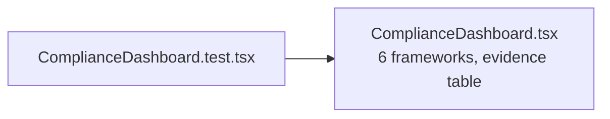

# PRD — Community 208: Compliance Dashboard UI Tests

**Status**: DONE  
**Effort**: 0.5 day  
**Date**: 2026-04-16

---

## Master Goal Mapping

| Dimension | Value |
|-----------|-------|
| ALDECI Goal | Compliance QA — validate 6-framework compliance dashboard |
| Persona | Compliance Officer |
| Priority | HIGH |

---

## Architecture Diagram

---

## Acceptance Criteria

- [x] Compliance dashboard renders
- [ ] Framework tabs (SOC2/ISO27001/PCI-DSS/HIPAA/NIST/GDPR) tested
- [ ] Evidence table populated

---

## Effort Estimate

**4 hours** — framework tab + evidence tests.

---

## Status

**IMPLEMENTED**
