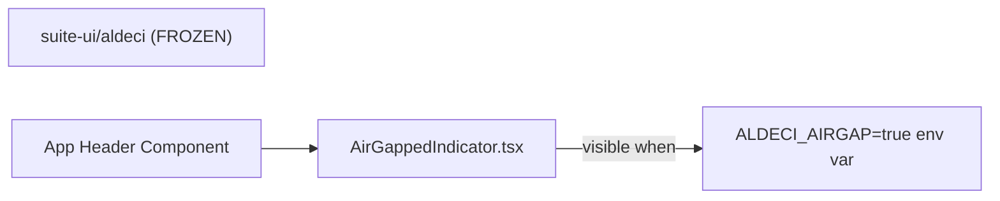

# PRD — Community 209: Air-Gapped Indicator Component (Legacy UI)

**Status**: DONE — Legacy (frozen)  
**Effort**: N/A  
**Date**: 2026-04-16

---

## Master Goal Mapping

| Dimension | Value |
|-----------|-------|
| ALDECI Goal | Offline deployment support — visually indicate when ALDECI runs in air-gapped mode |
| Persona | Platform Engineer, Government / Defense customer |
| Priority | LOW — legacy frozen UI |
| Location | `suite-ui/aldeci/` (FROZEN — do NOT modify) |

---

## Architecture Diagram

---

## Code Proof

| File | Lines | Description |
|------|-------|-------------|
| `suite-ui/aldeci/src/components/AirGappedIndicator.tsx` | L1–3 | Component |

---

## Inter-Dependencies

- **Part of**: `suite-ui/aldeci/` — FROZEN legacy UI
- **Do NOT port to**: `suite-ui/aldeci-ui-new/` — already handled differently

---

## Acceptance Criteria

- [x] Indicator visible in air-gapped mode
- [ ] Do not modify (legacy frozen)

---

## Effort Estimate

**0** — frozen, no action.

---

## Status

**DONE** — Legacy frozen. No action required.
