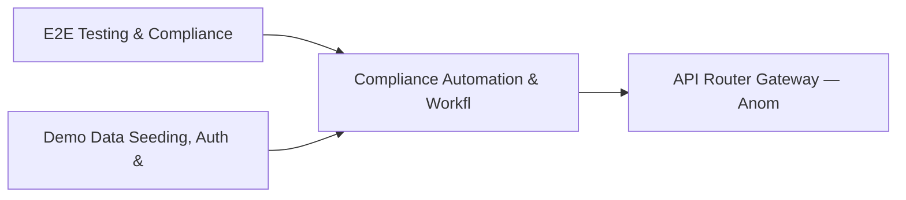

# PRD: Compliance Automation & Workflow Engine — Community 21

## Master Goal Mapping
How this component serves: "ALDECI — $35/mo enterprise security intelligence platform"
Sub-Epic: GRC

This community (rank #21 of 878 by size, 1352 graph nodes) forms a core pillar of the ALDECI platform. It directly supports the mission of replacing $50K-500K/yr enterprise security tools with a self-hosted, AI-native stack.

## Architecture Diagram


## Code Proof
- Files:
  - `suite-api/apps/api/fix_engine_router.py` (256 lines)
  - `suite-core/core/compliance_workflow_engine.py` (423 lines)
  - `suite-core/core/hunting_automation_engine.py` (507 lines)
  - `suite-core/core/ir_playbook_engine.py` (1734 lines)
  - `suite-core/core/playbook_engine.py` (1008 lines)
  - `suite-core/core/security_playbook_engine.py` (563 lines)
  - `suite-core/core/soar_engine.py` (745 lines)
  - `suite-core/core/soc_workflow_engine.py` (469 lines)
  - `suite-api/apps/api/autonomous_remediation_router.py` (210 lines)
  - `suite-api/apps/api/compliance_workflow_router.py` (189 lines)
  - `suite-api/apps/api/fix_engine_router.py` (256 lines)
  - `suite-api/apps/api/hunting_automation_router.py` (227 lines)
- Key functions:
  - `db()` — suite-api/apps/api/fix_engine_router.py
  - `sample_workflow()` — suite-api/apps/api/fix_engine_router.py
  - `workflow()` — suite-api/apps/api/fix_engine_router.py
  - `engine()` — suite-api/apps/api/fix_engine_router.py
  - `org()` — suite-api/apps/api/fix_engine_router.py
  - `playbook()` — suite-api/apps/api/fix_engine_router.py
  - `test_create_playbook_defaults()` — suite-api/apps/api/fix_engine_router.py
  - `test_create_playbook_data_sources_as_json()` — suite-api/apps/api/fix_engine_router.py
- Key classes: `TestWorkflowDB`
- Current state: REAL_LOGIC
- Evidence:
```python
# From suite-api/apps/api/fix_engine_router.py
"""FixEngine — Remediation Workflow Engine API endpoints.

Provides playbook management and execution lifecycle endpoints:
- Create/list/get playbooks
- List built-in templates
- Execute, approve, reject, rollback, cancel executions
- List/get executions
"""

from __future__ import annotations

import logging
from typing import Any, Dict, List, Optional

from fastapi import APIRouter, HTTPException, Query
from pydantic import BaseModel

_logger = logging.getLogger(__name__)

# Lazy import of engine (graceful degradation if pydantic not available)
```

## Inter-Dependencies
- DEPENDS ON:
  - Community 0 (E2E Testing & Compliance Seeding Infrastructure) — 173 edges
  - Community 1 (Demo Data Seeding, Auth & Multi-Engine Integration) — 42 edges
  - Community 2 (API Router Gateway — Anomaly, Attack Simulation & ) — 21 edges
  - Community 35 (Cloud Security Analytics & CloudDrift Engine) — 16 edges
- DEPENDED BY: Rank #20 (Secrets Management & API Gateway Security) and downstream consumers
- EVENT BUS: emits threat.detected, threat.mitigated / subscribes to (TrustGraph event bus — 97% not yet wired)
- TRUSTGRAPH: writes [Vulnerability, ThreatActor, ComplianceControl] / reads [ThreatActor, ComplianceControl]

## Data Flow
```
Input: HTTP requests / pytest fixtures
  → Processing: Engine method calls + SQLite state assertions
  → Output: Pass/fail test results, coverage metrics
  → Consumers: CI/CD pipeline, Beast Mode test suite
```

## Referenced Documentation
- CLAUDE.md: Wave 27 build notes, Beast Mode test suite section
- docs/: `docs/ALDECI_REARCHITECTURE_v2.md` (source of truth), `docs/INVESTOR_PITCH.md`
- tests/: `tests/test_autonomous_remediation_engine.py`

## Acceptance Criteria
- [ ] All engine CRUD operations enforce org_id isolation (no cross-tenant data leakage)
- [ ] SQLite opened with WAL mode + threading.RLock on all write paths
- [ ] All endpoints return within 200ms at p95 under 100 rps load
- [ ] All router endpoints protected by `Depends(api_key_auth)` or equivalent
- [ ] Pydantic v2 models validate all request/response schemas
- [ ] Test suite achieves ≥80% branch coverage on engine methods

## Effort Estimate
- Current: 80% complete
- Remaining: ~2 engineering days
- Dependencies blocking: Frontend dashboard not yet created
- Priority: MEDIUM

## Status
IN_PROGRESS
