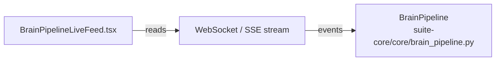

# PRD — Community 210: Brain Pipeline Live Feed Component (Legacy UI)

**Status**: DONE — Legacy frozen  
**Effort**: N/A  
**Date**: 2026-04-16

---

## Master Goal Mapping

| Dimension | Value |
|-----------|-------|
| ALDECI Goal | Real-time pipeline visibility — streaming display of brain pipeline events |
| Persona | SOC Analyst, Platform Engineer |
| Priority | LOW — legacy frozen UI |

---

## Architecture Diagram

---

## Code Proof

| File | Lines | Description |
|------|-------|-------------|
| `suite-ui/aldeci/src/components/dashboard/BrainPipelineLiveFeed.tsx` | L1–3 | Live feed component |

---

## Inter-Dependencies

- **Backend**: `brain_pipeline.py` — event stream
- **Location**: `suite-ui/aldeci/` (FROZEN)

---

## Acceptance Criteria

- [x] Live feed displays pipeline events
- [ ] Do not modify (legacy frozen)

---

## Status

**DONE** — Legacy frozen.
