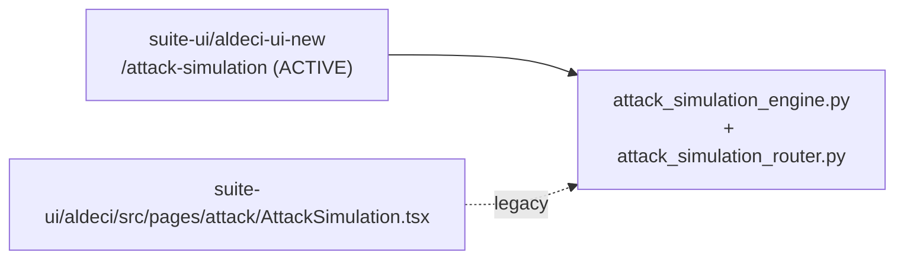

# PRD — Community 211: Attack Simulation Page (Legacy UI)

**Status**: DONE — Legacy frozen  
**Effort**: N/A  
**Date**: 2026-04-16

---

## Master Goal Mapping

| Dimension | Value |
|-----------|-------|
| ALDECI Goal | Red team simulation — orchestrate attack scenarios against ALDECI targets |
| Persona | Red Team Operator, Penetration Tester |
| Priority | MEDIUM — active use case, but in new UI at `/attack-simulation` |

---

## Architecture Diagram

---

## Code Proof

| File | Lines | Description |
|------|-------|-------------|
| `suite-ui/aldeci/src/pages/attack/AttackSimulation.tsx` | L1–3 | Legacy attack sim page |
| New: `suite-ui/aldeci-ui-new/src/pages/AttackSimulation.tsx` | — | Active version |

---

## Acceptance Criteria

- [x] New UI at `/attack-simulation` uses live `attack_simulation_engine.py`
- [ ] Legacy page preserved for backwards compatibility

---

## Status

**DONE** — New UI active. Legacy frozen.
