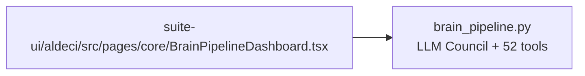

# PRD — Community 212: Brain Pipeline Dashboard (Legacy UI)

**Status**: DONE — Legacy frozen  
**Effort**: N/A  
**Date**: 2026-04-16

---

## Master Goal Mapping

| Dimension | Value |
|-----------|-------|
| ALDECI Goal | Core engine monitoring — dashboard for brain_pipeline.py execution stats |
| Persona | Platform Engineer, CTO |
| Priority | MEDIUM |

---

## Architecture Diagram

---

## Code Proof

| File | Lines | Description |
|------|-------|-------------|
| `suite-ui/aldeci/src/pages/core/BrainPipelineDashboard.tsx` | L1–3 | Legacy dashboard |

---

## Status

**DONE** — Legacy frozen.
